# Agentic Coding für kreative Teams - Tag 2

## Slide 1: Agentic Coding Tag 2

_Projekte, Skills, Tools und sichere Grenzen_

Speaker notes: Verbinde die Agenten-Grundlagen von gestern mit den praktischen Codex-Bausteinen von heute.

## Slide 2: Übung 4: Der Fehlerfall

_Dauer: 5 Minuten_

Ziel: Nicht nur den Idealzustand betrachten.

**Definiert mindestens drei allgemeine Fehlerzustände**

- Datei fehlt
- Format ist falsch
- Eingabe ist leer
- URL ist nicht erreichbar
- Pflichtspalten fehlen
- Ergebnis ist uneindeutig
- mehrere Regeln widersprechen sich

## Slide 3: Übung 5: Den ersten LLM-Prompt schreiben

_Dauer: 10 Minuten_

**Vorlage**

```text
Baue eine lokale Anwendung, die [Ziel] unterstützt.
Als Input verwendet sie [Input].
Das Programm soll:
- …
- …
- …
Beachte folgende Regeln: [Regeln].
Das Ergebnis soll [Output] sein.
Die Aufgabe ist fertig, wenn [Prüfkriterien] erfüllt sind.
Das Programm darf nicht [Grenzen].
```

## Slide 4: Projekt / Skill / Tool

_Vom Arbeitsraum zur Handlung_

**Projekt**

Arbeitsraum mit Kontext

Metapher: Restaurant


**Skill**

Wiederverwendbare Anleitung

Metapher: Rezeptkarte


**Tool**

Kann etwas ausführen

Metapher: Küchenwerkzeug


## Slide 5: Projekt

_Was es ist · Warum es hilft · Wie du es nutzt_

Ein Projekt ist ein eigener Arbeitsbereich, der Dateien, Kontext und Regeln für ein Vorhaben zusammenführt.

**Was ist es?**

- Dateien, Kontext und Projektregeln

**Warum nutzen?**

- Hält den Agenten bei der richtigen Aufgabe
- Trennt Projekte und sensible Daten

## Slide 6: Projekt: Nutzung und Sicherheit

_Was es ist · Warum es hilft · Wie du es nutzt_

**Wie nutzen?**

- Zuerst das passende Projekt auswählen
- Nur hinzufügen, was die Aufgabe braucht

**Sicherheit**

Halte Secrets, Kundendaten, Produktionsdateien und private Notizen außerhalb des Projekts, außer die Aufgabe braucht sie wirklich.

## Slide 7: Neues Projekt erstellen

_Schritt 1 von 3 — Einen eigenen Workspace starten_

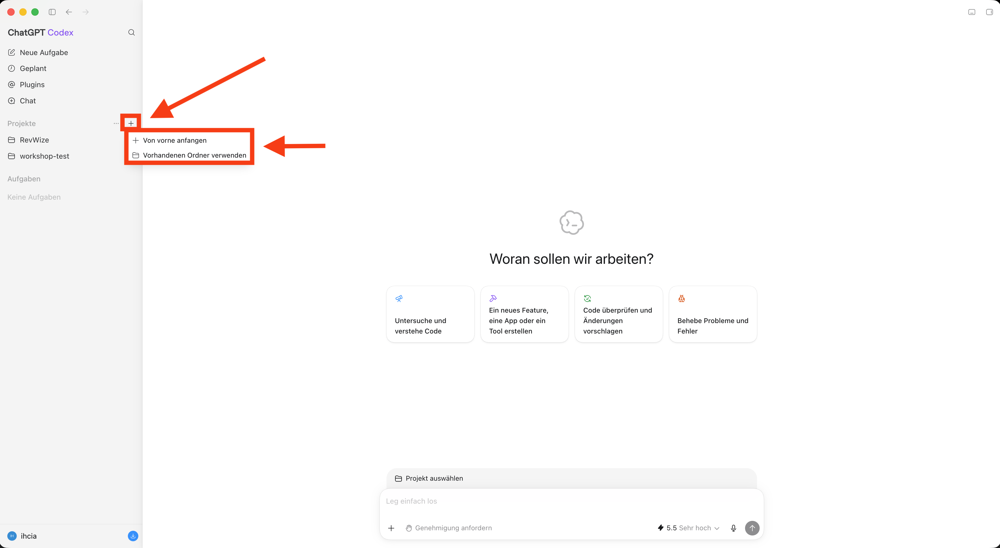

## Slide 8: Projekt eindeutig benennen

_Schritt 2 von 3 — Den Kontext erkennbar machen_

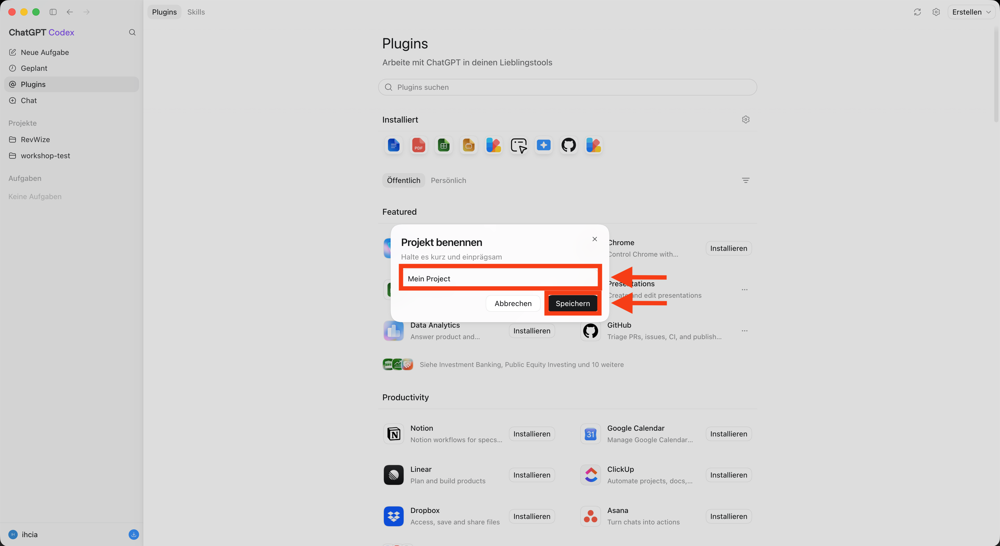

## Slide 9: Projekt für die Aufgabe auswählen

_Schritt 3 von 3 — Im richtigen Kontext arbeiten_

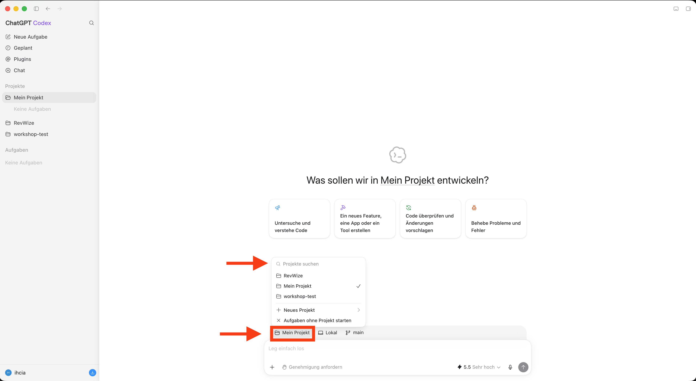

## Slide 10: Gib dem Agenten nur den nötigen Zugriff

_Starte mit dem sichersten Freigabemodus für das Projekt_

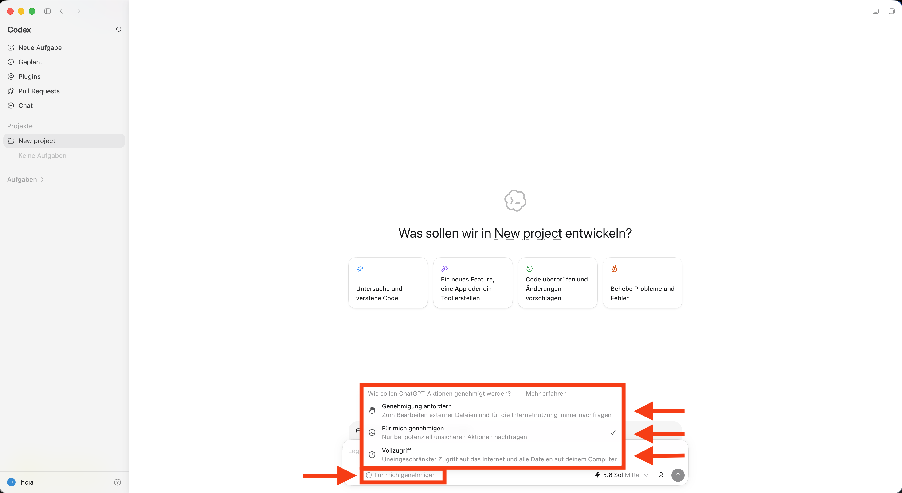

Speaker notes: Wähle den engsten Freigabemodus, mit dem der Agent die Aufgabe noch erledigen kann. Nutze Genehmigung anfordern, wenn externe Dateien oder Internetzugriff sensibel sind. Vollzugriff nur verwenden, wenn er wirklich nötig und der Workspace sicher ist.

## Slide 11: Planmodus

_Erst verstehen · dann planen · danach umsetzen_

Im Planmodus sammelt Codex Kontext, stellt Rückfragen und erstellt vor der Umsetzung einen besseren Plan.

**Verstehen**

- Sammelt relevanten Kontext
- Stellt klärende Rückfragen

**Planen**

- Schlägt klare Umsetzungsschritte vor
- Macht Annahmen sichtbar

**Nutzen bei**

- Komplexen oder mehrstufigen Aufgaben
- Unklaren Anforderungen

**Kernidee**

Einigt euch auf den Weg, bevor Codex Dateien verändert.

Speaker notes: Das Codex-Handbuch empfiehlt den Planmodus für komplexe, unklare oder schwer zu beschreibende Aufgaben. Codex sammelt Kontext, stellt Rückfragen und bereitet vor der Umsetzung einen besseren Plan vor.

## Slide 12: Planmodus einschalten

_Schritt 1 von 3 — + öffnen und Planmodus wählen_

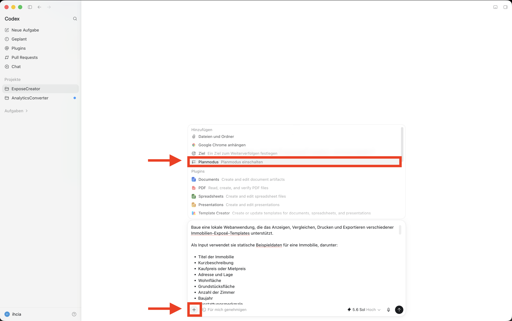

Speaker notes: Öffne das Hinzufügen-Menü und wähle Planmodus, bevor du einen komplexen Prompt abschickst. In unterstützten Codex-Oberflächen lässt sich der Planmodus auch mit /plan oder Umschalt+Tab ein- und ausschalten.

## Slide 13: Dateien und Ordner hinzufügen

_Schritt 1 von 3 — + öffnen und Dateien und Ordner wählen_

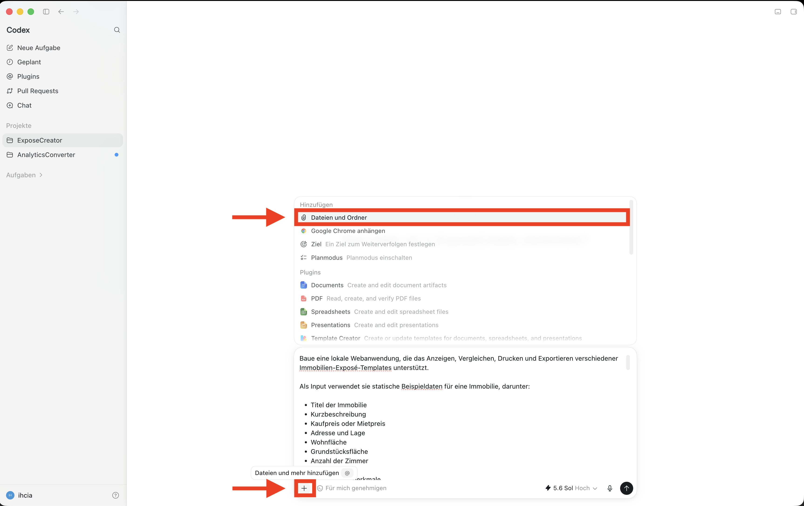

Speaker notes: Füge nur die Dateien oder Ordner hinzu, die Codex für die Aufgabe braucht. Teile nicht den gesamten Drive oder unbeteiligtes Kundenmaterial.

## Slide 14: Relevantes Material auswählen

_Schritt 2 von 3 — Datei oder Ordner auswählen_

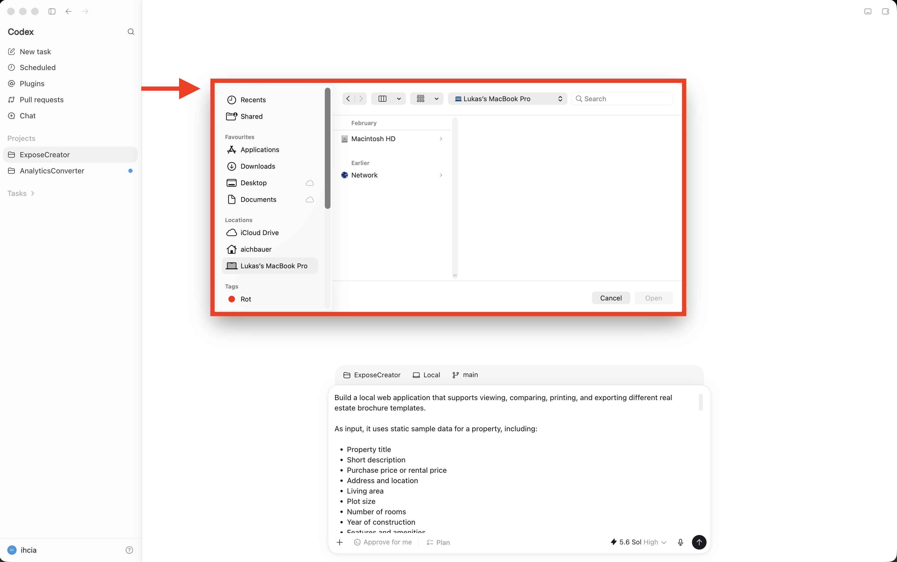

Speaker notes: Wähle den kleinsten sinnvollen Umfang. Ein fokussiertes Briefing oder ein Projektordner gibt Codex besseren Kontext und reduziert versehentlich geteilte Daten.

## Slide 15: Anhang vor dem Senden prüfen

_Schritt 3 von 3 — Den richtigen Kontext bestätigen_

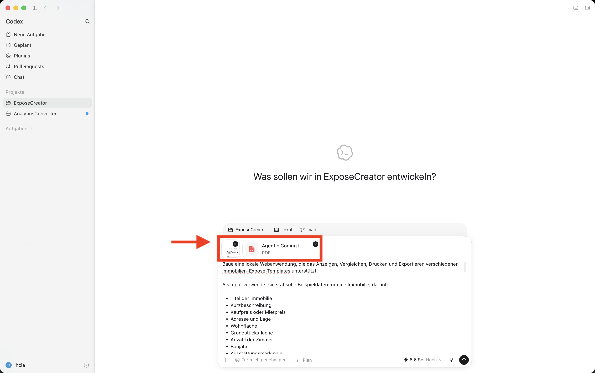

Speaker notes: Prüfe die Anhänge, bevor du die Aufgabe startest. Entferne alles, was nicht dazugehört, sensibel ist oder nicht mehr gebraucht wird.

## Slide 16: Klärende Rückfragen beantworten

_Schritt 2 von 3 — Wichtige Entscheidungen vor der Umsetzung klären_

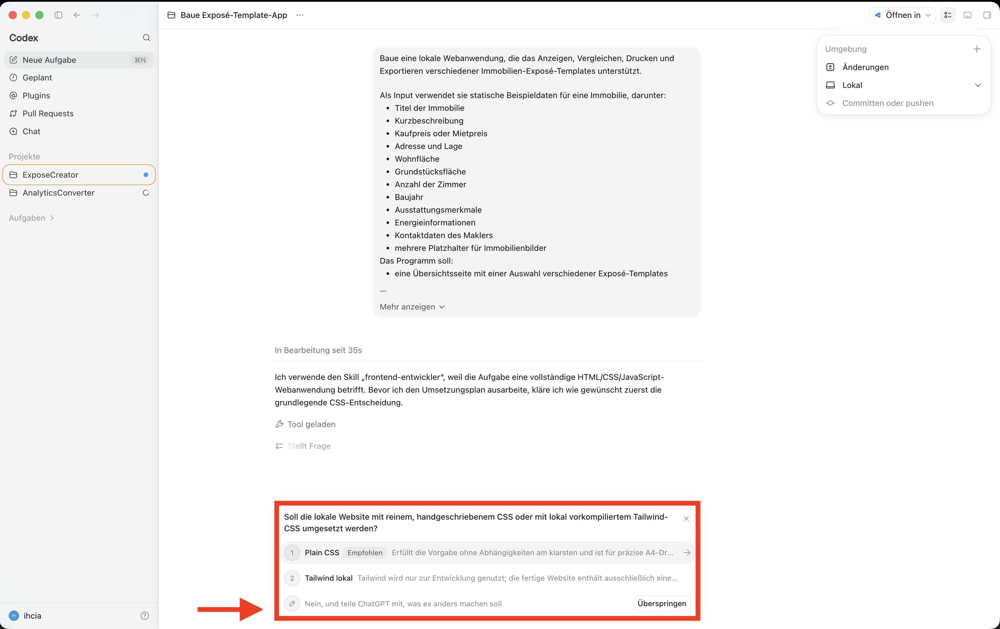

Speaker notes: Der Planmodus kann gezielte Rückfragen stellen, wenn eine wichtige Anforderung unklar ist. Wähle eine Option oder gib eine eigene Antwort, damit Codex den Plan auf den richtigen Annahmen aufbaut.

## Slide 17: Plan umsetzen

_Schritt 3 von 3 — Plan prüfen und Umsetzung bestätigen_

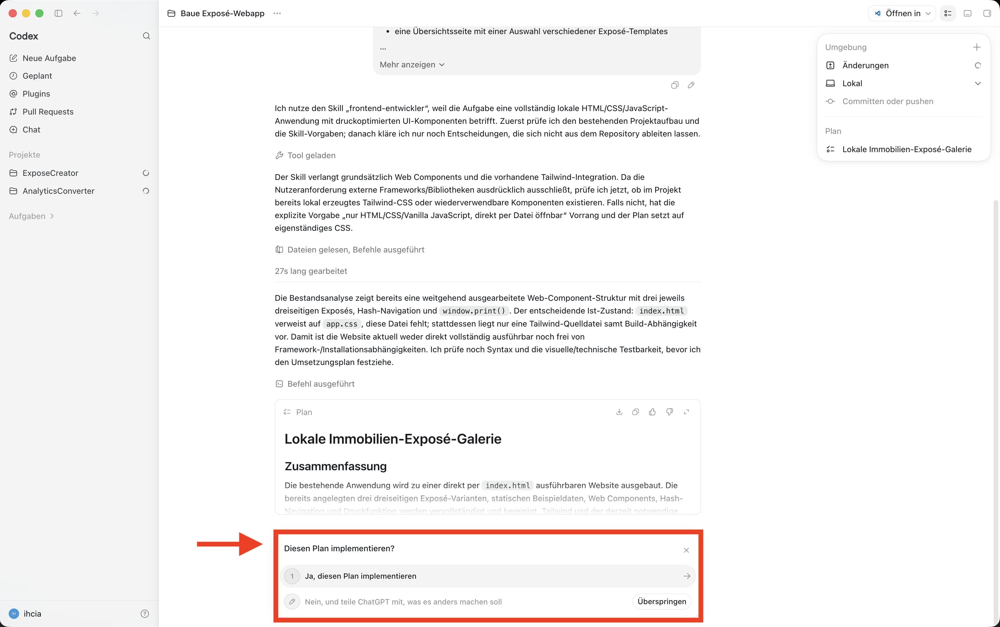

Speaker notes: Prüfe Zusammenfassung, Umfang und Annahmen des Plans, bevor du fortfährst. Wähle Ja, diesen Plan implementieren nur, wenn der vorgeschlagene Weg zur Aufgabe passt.

## Slide 18: Skill

_Was es ist · Warum es hilft · Wie du es nutzt_

Ein Skill ist eine wiederverwendbare Arbeitsanleitung, die Codex eine bestimmte Art von Aufgabe beibringt.

**Was ist es?**

- Anweisungen, Referenzen und Checks

**Warum nutzen?**

- Konsistentere Ergebnisse
- Weniger wiederholte Prompts

## Slide 19: Skill: Nutzung und Sicherheit

_Was es ist · Warum es hilft · Wie du es nutzt_

**Wie nutzen?**

- Für wiederkehrende Aufgaben einsetzen
- $skill-name nennen oder Codex wählen lassen

**Sicherheit**

Lies einen Skill, bevor du ihm vertraust. Nutze fokussierte Skills aus vertrauenswürdigen Quellen und prüfe, welche Tools, Dateien oder externen Dienste sie erwarten.

## Slide 20: Skill mit Skill Creator erstellen

_Skill auswählen und Aufgabe beschreiben_

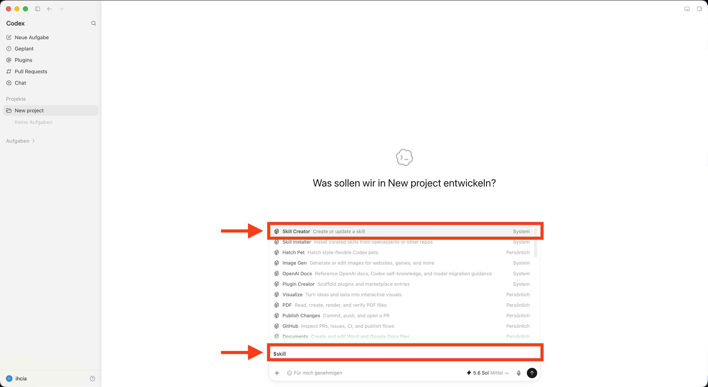

Speaker notes: Gib $skill ein, wähle Skill Creator und beschreibe eine fokussierte Aufgabe, ihren Trigger und das erwartete Ergebnis. Prüfe und teste den erzeugten Skill vor der Nutzung.

## Slide 21: Beschreibe, was der Skill tun soll

_Name, Trigger und klare Grenzen festlegen_

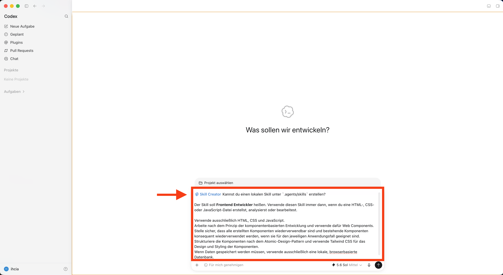

Speaker notes: Ein guter Auftrag nennt den Skill, erklärt, wann er aktiv werden soll, und beschreibt die Standards oder Grenzen, die er einhalten muss.

## Slide 22: Öffne den erstellten Skill

_Skill Creator erstellt und validiert die lokalen Dateien_

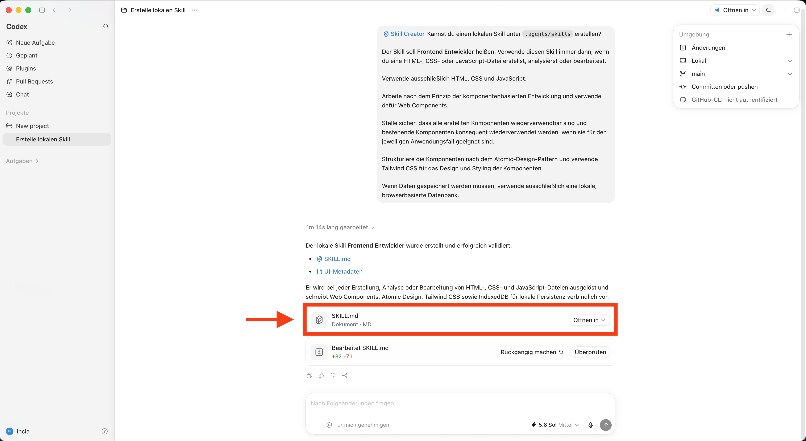

Speaker notes: Prüfe nach der Erstellung, ob Codex den Skill als gültig meldet, und öffne anschließend die erzeugten Dateien.

## Slide 23: Prüfe die Skill-Metadaten

_openai.yaml steuert Darstellung und Start des Skills_

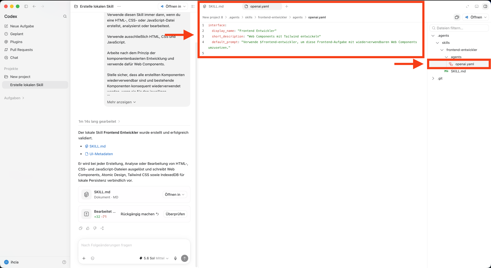

Speaker notes: Prüfe Anzeigename, Kurzbeschreibung und Standard-Prompt in agents/openai.yaml. Der Skill soll leicht erkennbar und nutzbar sein.

## Slide 24: Prüfe die Skill-Anweisungen

_SKILL.md definiert Trigger, Workflow und Grenzen_

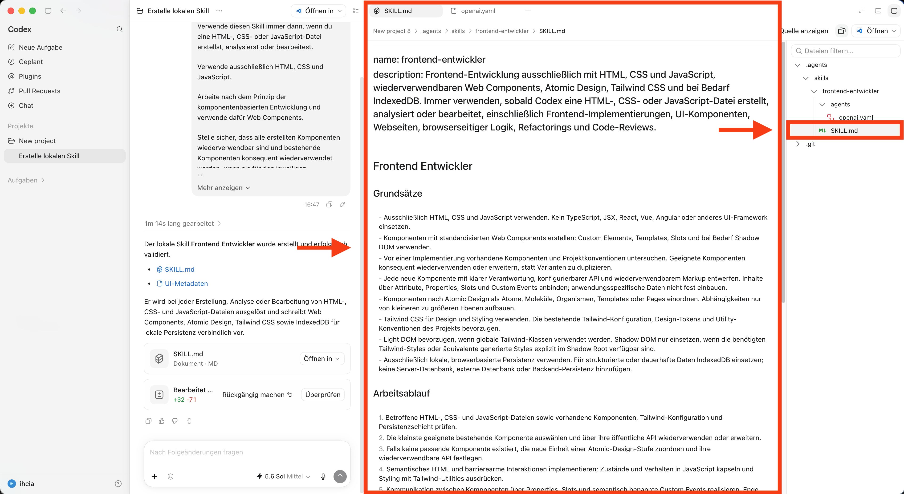

Speaker notes: Lies die vollständige SKILL.md vor der Nutzung. Prüfe, ob der Trigger präzise und die Anweisungen geordnet, fokussiert und testbar sind.

## Slide 25: Ein guter Skill ist fokussiert und testbar

_Lokaler Pflichtkern, optionale Unterstützung_

**Ordnerstruktur**

```text
my-skill/
├── SKILL.md                 Pflicht
├── agents/
│   └── openai.yaml          Pflicht für lokale Skills
├── references/
│   └── some.md              optional: Detailkontext
└── scripts/                 optional: deterministische Helfer
```

Speaker notes: Für lokale Workshop-Skills ist agents/openai.yaml neben SKILL.md verpflichtend. Im allgemeinen Codex-Skill-Format ist diese Metadatendatei optional. Separate Referenzen unterstützen Progressive Disclosure.

## Slide 26: Skill: Qualitätscheck

_Lokaler Pflichtkern, optionale Unterstützung_

**Qualitätscheck**

- Eine klar abgegrenzte Aufgabe
- Präzise Trigger-Beschreibung
- Explizite Ein- und Ausgaben
- Imperative, geordnete Schritte
- Beispiele und Checks nur, wenn nützlich

**Regel**

Lokaler Standard: SKILL.md und agents/openai.yaml gehören immer dazu. Referenzen und Skripte ergänzt du nur, wenn der Workflow sie braucht.

Speaker notes: Für lokale Workshop-Skills ist agents/openai.yaml neben SKILL.md verpflichtend. Im allgemeinen Codex-Skill-Format ist diese Metadatendatei optional. Separate Referenzen unterstützen Progressive Disclosure.

## Slide 27: Tool

_Was es ist · Warum es hilft · Wie du es nutzt_

Ein Tool ist ein Programm oder eine Schnittstelle, die Codex nutzen kann, um Informationen abzurufen oder eine Aufgabe auszuführen.

**Was ist es?**

- Programme: Browser, Terminal, Excel
- Dienste: GitHub, Google Drive, Slack

**Warum nutzen?**

- Informationen suchen, lesen und prüfen
- Aufgaben direkt in anderen Programmen erledigen

## Slide 28: Tool: Nutzung und Sicherheit

_Was es ist · Warum es hilft · Wie du es nutzt_

**Wie nutzen?**

- Passendes Tool für die Aufgabe auswählen
- Zugriff prüfen und Ergebnis kontrollieren

**Sicherheit**

Tools machen Risiko real. Prüfe alles, was löscht, veröffentlicht, Nachrichten sendet, Software installiert, externe Dienste nutzt oder Daten teilt.

## Slide 29: Plugin installieren

_Plugins öffnen -> Zugriffe prüfen -> Installieren_

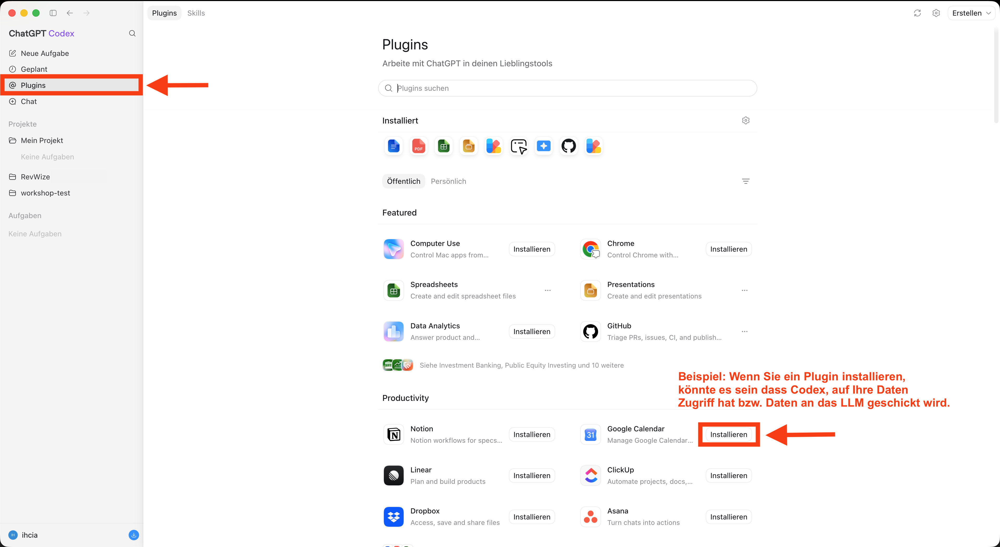

Speaker notes: Plugins sind installierbare Pakete. Prüfe die angeforderten Zugriffe vor der Installation. In der CLI: /plugins ausführen, aus einem konfigurierten Marketplace installieren und eine neue Session starten.

## Slide 30: Öffne vor der Installation die Plugin-Details

_Wähle das Plugin aus, das du prüfen möchtest_

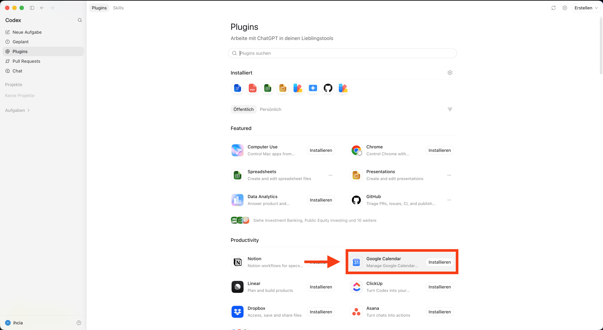

Speaker notes: Installiere nicht allein aus der Verzeichnisansicht. Öffne die Plugin-Details, damit du den Inhalt des Pakets und seine Zugriffe prüfen kannst.

## Slide 31: Prüfe den Inhalt des Plugins

_Kontrolliere jede enthaltene App und jeden Skill_

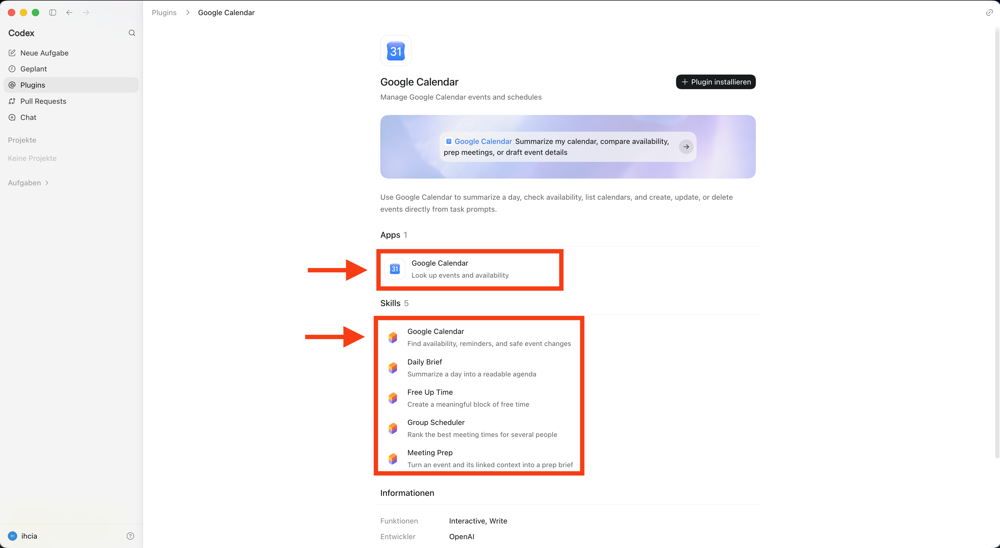

Speaker notes: Ein Plugin kann Apps und Skills bündeln. Prüfe jede enthaltene Fähigkeit und verlasse dich nicht nur auf den Namen oder die Kurzbeschreibung des Plugins.

## Slide 32: Prüfe die Aktionen der App

_Achte besonders auf Schreib- und Löschaktionen_

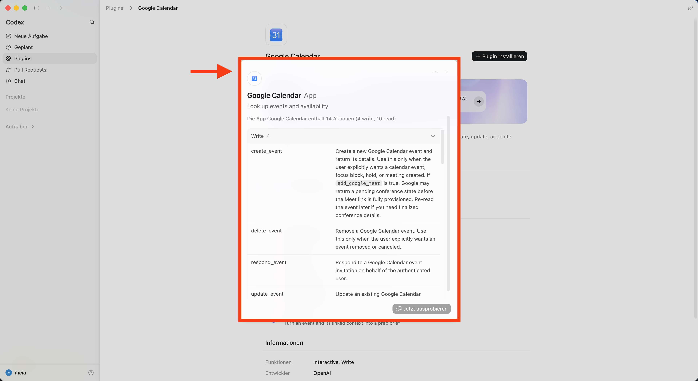

Speaker notes: Prüfe, welche Aktionen nur Informationen lesen und welche Daten erstellen, ändern, löschen oder senden können. Erlaube nur Zugriffe, die deine Aufgabe wirklich benötigt.

## Slide 33: Lies den enthaltenen Skill vor der Nutzung

_Prüfe Workflow, Grenzen und erwartetes Ergebnis_

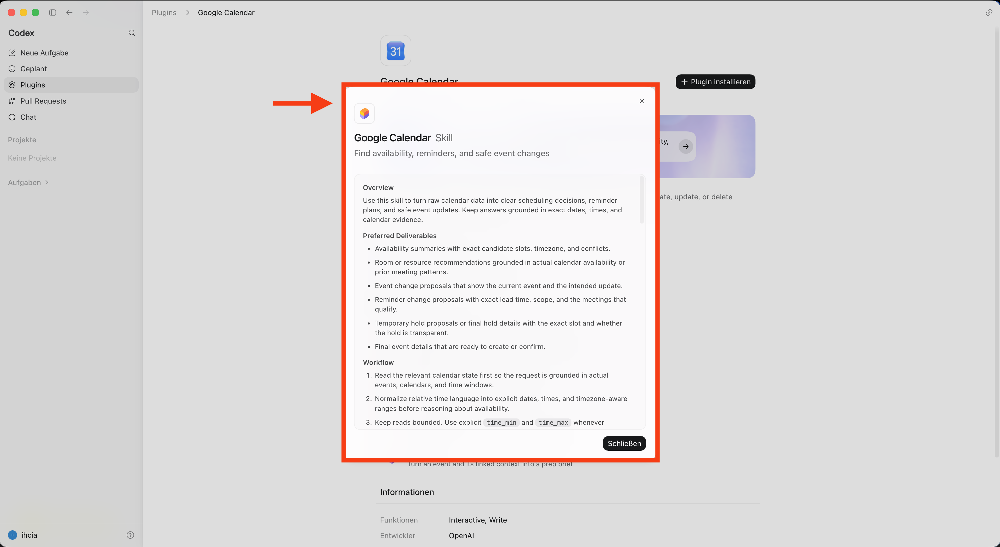

Speaker notes: Lies die Skill-Anweisungen, bevor du ihnen vertraust. Prüfe, ob der Workflow relevant, die Grenzen sicher und die erwarteten Ergebnisse für deine Aufgabe geeignet sind.

## Slide 34: Skill oder Plugin? Der Bedarf entscheidet

_Prozess = Skill · Verbundenes Tool oder Information = Plugin_

**Skill**

- Bringt Codex euren wiederholbaren Prozess bei
- Nutzen für konsistente Regeln, Reihenfolge, Ton oder Format
- $ drücken und den Skill auswählen
- Beispiel: Wochenupdate im Format eures Teams erstellen

**Plugin**

- Verbindet Codex mit anderen Tools und Informationen
- Nutzen für Google Drive, E-Mail oder einen anderen Dienst
- Plugins öffnen, Zugriff prüfen und installieren
- Beispiel: aktuelle Projektdateien aus Google Drive abrufen

Speaker notes: Quelle: OpenAI Academy — Plugins and skills, https://openai.com/academy/codex-plugins-and-skills/. Die Faustregel: Plugin für Informationen aus einem anderen Tool, Skill für den eigenen Prozess und beides, wenn der Prozess verbundene Informationen nutzt.

## Slide 35: Skill und Plugin kombinieren

_Prozess = Skill · Verbundenes Tool oder Information = Plugin_

**Beides nutzen**

Kombiniere Skill und Plugin, wenn dein Prozess Informationen aus einem verbundenen Tool braucht.

Speaker notes: Quelle: OpenAI Academy — Plugins and skills, https://openai.com/academy/codex-plugins-and-skills/. Die Faustregel: Plugin für Informationen aus einem anderen Tool, Skill für den eigenen Prozess und beides, wenn der Prozess verbundene Informationen nutzt.

## Slide 36: Top 10 AI-Sicherheitstipps

_Einfache Regeln für den Arbeitsalltag_

**10 einfache Regeln · 1–5**

- 1. Nur freigegebenes Material nutzen — Firmenbilder statt kopierter Google-Bilder verwenden
- 2. So wenig wie möglich teilen — Kundennamen, Adressen und private Notizen entfernen
- 3. Passwörter geheim halten — Passwörter oder Zugangscodes nie in einen AI-Chat kopieren
- 4. Nur Nötiges öffnen — einen Kampagnenordner statt des ganzen Drives freigeben
- 5. Verbundene Apps prüfen — wissen, was ein AI-Tool lesen, ändern oder senden darf

Speaker notes: Diese Regeln gelten für den Marketing-Alltag. Die Kernidee: weniger teilen, Zugriffe prüfen, letzte Entscheidungen bei Menschen lassen, AI-Ergebnisse kontrollieren und bei Auffälligkeiten stoppen.

## Slide 37: AI-Sicherheitstipps: Prüfen und Handeln

_Einfache Regeln für den Arbeitsalltag_

**10 einfache Regeln · 6–10**

- 6. Letzte Entscheidungen bei Menschen lassen — vor Senden, Veröffentlichen, Löschen oder Geldausgeben prüfen
- 7. Nicht jeder Anweisung vertrauen — eine Datei oder Website kann die AI zum Teilen von Informationen verleiten
- 8. Ergebnis kontrollieren — Namen, Fakten, Preise, Daten, Links, Quellen und Markenton prüfen
- 9. Zuerst mit einer Kopie testen — Kampagne in der Vorschau prüfen und das Original sichern
- 10. Stoppen, wenn etwas komisch wirkt — Tool trennen, offengelegte Passwörter ändern und verantwortliche Person informieren

Speaker notes: Diese Regeln gelten für den Marketing-Alltag. Die Kernidee: weniger teilen, Zugriffe prüfen, letzte Entscheidungen bei Menschen lassen, AI-Ergebnisse kontrollieren und bei Auffälligkeiten stoppen.

## Slide 38: Zusammenfassung: Projekte & Planmodus

_Wörter rund um Workspace und Planung_

| Wort | Bedeutung | Metapher |
| --- | --- | --- |
| Projekt | Ein eigener Workspace mit Dateien, Kontext und Regeln für einen Arbeitsbereich. | 🏪 Restaurant |
| Zugriffsmodus | Steuert, was der Agent tun darf und wann er eine Freigabe braucht. | 🔑 Küchenschlüssel |
| Dateien und Ordner | Das fokussierte Aufgabenmaterial, das Codex als Kontext erhält. | 🧺 Zutatenkorb |
| Planmodus | Codex sammelt Kontext, stellt Rückfragen und schlägt vor der Umsetzung einen Plan vor. | 📝 Vorbereitungsplan |
| Klärende Rückfrage | Klärt eine wichtige offene Entscheidung, bevor die Arbeit startet. | 🙋 Koch fragt den Gast |
| Plan umsetzen | Startet die Arbeit, nachdem der vorgeschlagene Weg geprüft wurde. | ▶️ Kochen starten |

## Slide 39: Zusammenfassung: Skills & Tools

_Wiederverwendbare Prozesse und Fähigkeiten_

| Wort | Bedeutung | Metapher |
| --- | --- | --- |
| Skill | Eine wiederverwendbare Anleitung, die Codex eine fokussierte Aufgabe beibringt. | 📘 Rezeptkarte |
| SKILL.md | Die Hauptdatei mit Trigger, Workflow und Grenzen des Skills. | 📖 Rezept |
| openai.yaml | Metadaten, die Darstellung und Start eines lokalen Skills steuern. | 🏷️ Rezeptetikett |
| Tool | Ein Programm oder eine Schnittstelle, mit der Codex Informationen abruft oder handelt. | 🛠️ Küchenwerkzeug |
| Plugin | Ein installierbares Paket mit Apps, Skills und verbundenen Fähigkeiten. | 🧰 Werkzeugkiste |
| App-Aktion | Eine verbundene Aktion, die Daten lesen, erstellen, ändern, löschen oder senden kann. | 🔌 Verbundenes Küchengerät |
| Skill + Plugin | Ein wiederholbarer Prozess, der Informationen oder Aktionen aus einem anderen Tool nutzt. | 📘 Rezept + Vorratskammer |

## Slide 40: Zusammenfassung: Sicher arbeiten

_Sicherheitsregeln und Metaphern für den Alltag_

| Regel | Bedeutung | Metapher |
| --- | --- | --- |
| Wenigster Zugriff | Wähle den engsten Zugriff, mit dem die Aufgabe noch möglich ist. | 🔑 Ein Küchenschlüssel |
| Minimaler Kontext | Füge nur Dateien und Ordner hinzu, die die Aufgabe wirklich braucht. | 🥕 Zutaten für ein Gericht |
| Vertrauenswürdige Quellen | Prüfe Skills, Plugins, Anweisungen und angeforderte Zugriffe vor der Nutzung. | ✅ Freigegebener Lieferant |
| Freigabe durch Menschen | Ein Mensch entscheidet vor Senden, Veröffentlichen, Löschen oder Geldausgeben. | 🧑‍🍳 Küchenchef gibt frei |
| Ergebnis prüfen | Kontrolliere Fakten, Namen, Preise, Daten, Links, Quellen und Markenton. | 👅 Geschmackstest |
| Mit einer Kopie testen | Prüfe Änderungen in der Vorschau und sichere das Original. | 🍽️ Probeteller + Reserve |
| Stoppen und melden | Trenne das Tool und informiere die verantwortliche Person, wenn etwas auffällig ist. | 🛑 Not-Aus |
