# Agentic Coding for Creative Teams - Day 2

## Slide 1: Agentic Coding Day 2

_Projects, skills, tools, and safe boundaries_

Speaker notes: Connect yesterday's agent basics to today's practical Codex building blocks.

## Slide 2: Exercise 4: The Error Case

_Duration: 5 minutes_

Goal: look beyond the ideal path.

Define at least three general error states:

- file is missing
- format is wrong
- input is empty
- URL is not reachable
- required columns are missing
- result is ambiguous
- multiple rules contradict each other

Coffee shop landing page example: If the menu CSV is missing prices, the program should mark the affected drinks, keep generating the page, and show a warning in the report.

Question: What should the program do in this case?

## Slide 3: Exercise 5: Write the First LLM Prompt

_Duration: 10 minutes_

Template:

```text
Build a local application that supports [goal].
It uses [input] as input.
The program should:
- ...
- ...
- ...
Follow these rules: [rules].
The result should be [output].
The task is done when [check criteria] are met.
The program must not [boundaries].
```

Coffee shop landing page: Build a local app that turns a seasonal coffee campaign briefing into a responsive landing page preview with headline, offer, menu teaser, photos, opening hours, and CTA.

## Slide 4: Project / Skill / Tool

_From workspace to action_

- Project
  - Icons: 🏪
  - Workspace with context
  - Metaphor: restaurant
- Skill
  - Icons: 📘
  - Reusable instruction
  - Metaphor: recipe card
- Tool
  - Icons: 🛠️
  - Can execute an action
  - Metaphor: kitchen tool

## Slide 5: Project

_What it is · Why it helps · How to use it_

A project is a dedicated workspace that brings together the files, context, and rules for one area of work.

| Question | Answer |
| --- | --- |
| What is it? | Files, context, and project rules in one workspace |
| Why use it? | Keeps the agent on the right task and separates projects and sensitive data |
| How do I use it? | Select the right project first and add only what the task needs |

Security: Keep secrets, client data, production files, and private notes outside the project unless the task genuinely needs them.

## Slide 6: Create a new project

_Step 1 of 3 — Start a dedicated workspace_

Visual: One large Codex screenshot showing how to create a new project.

## Slide 7: Give the project a clear name

_Step 2 of 3 — Make the context recognizable_

Visual: One large Codex screenshot showing the project-name dialog.

## Slide 8: Select the project for the task

_Step 3 of 3 — Work in the right context_

Visual: One large Codex screenshot showing project selection.

## Slide 9: Give the agent only the access it needs

_Start with the safest approval mode for the project_

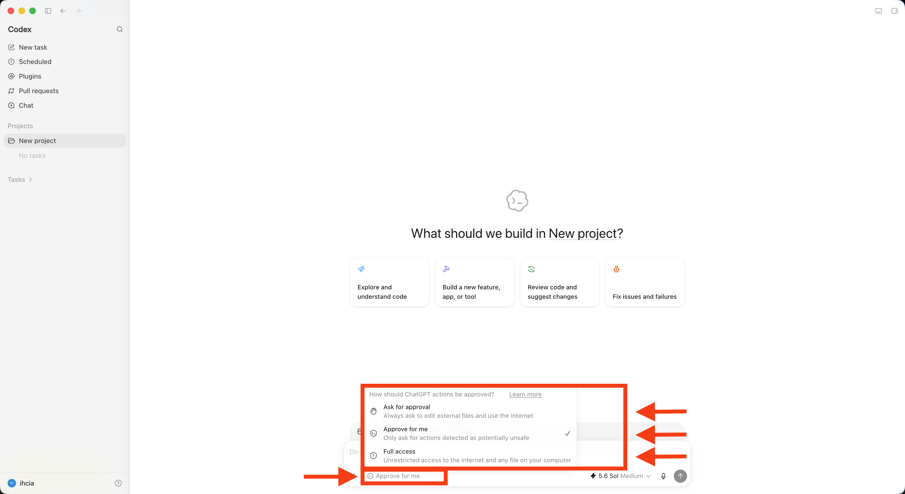

Speaker notes: Choose the narrowest approval mode that still lets the agent complete the task. Prefer Ask for approval when external files or internet access are sensitive. Use Full access only when it is truly necessary and the workspace is safe.

## Slide 10: Plan Mode

_Understand first · Plan second · Implement after_

Plan Mode lets Codex gather context, ask clarifying questions, and build a stronger plan before implementation.

| Stage | What Codex does |
| --- | --- |
| Understand | Gathers relevant context and asks clarifying questions |
| Plan | Proposes clear implementation steps and makes assumptions visible |
| Best for | Complex, multi-step tasks and ambiguous requirements |

Key idea: Agree on the route before Codex changes files.

Speaker notes: The Codex manual recommends Plan Mode for complex, ambiguous, or hard-to-describe tasks. It lets Codex gather context, ask clarifying questions, and prepare a stronger plan before implementation.

## Slide 11: Turn Plan Mode on

_Step 1 of 3 — Open + and choose Plan mode_

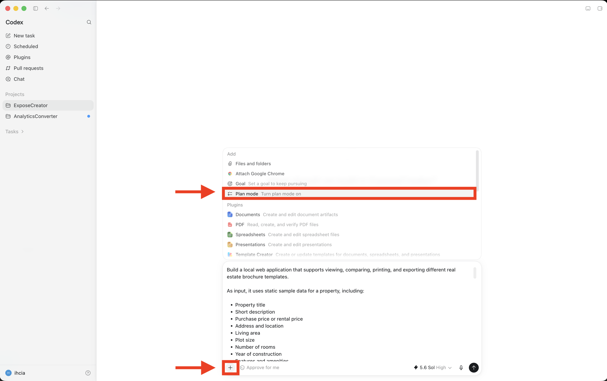

Speaker notes: Open the add menu and choose Plan mode before sending a complex prompt. In supported Codex surfaces, `/plan` or Shift+Tab can also toggle Plan Mode.

## Slide 12: Add files and folders

_Step 1 of 3 — Open + and choose Files and folders_

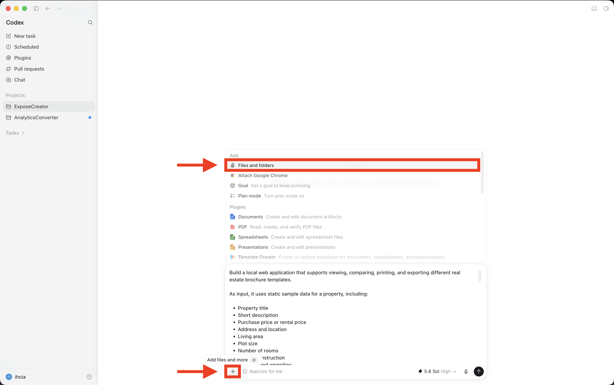

Speaker notes: Add only the files or folders Codex needs for the task. Avoid sharing an entire drive or unrelated client material.

## Slide 13: Choose the relevant material

_Step 2 of 3 — Select a file or folder_


Speaker notes: Select the smallest useful scope. A focused brief or project folder gives Codex better context and reduces accidental data exposure.

## Slide 14: Check the attachment before sending

_Step 3 of 3 — Confirm the right context is attached_

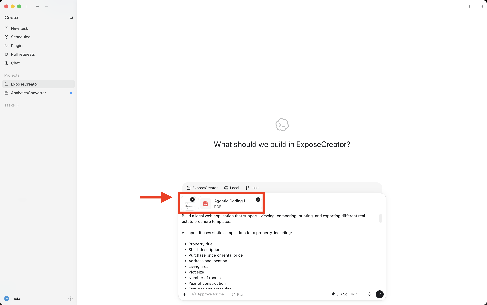

Speaker notes: Review the attachment chips before starting the task. Remove anything that is unrelated, sensitive, or no longer needed.

## Slide 15: Answer clarifying questions

_Step 2 of 3 — Resolve important decisions before implementation_

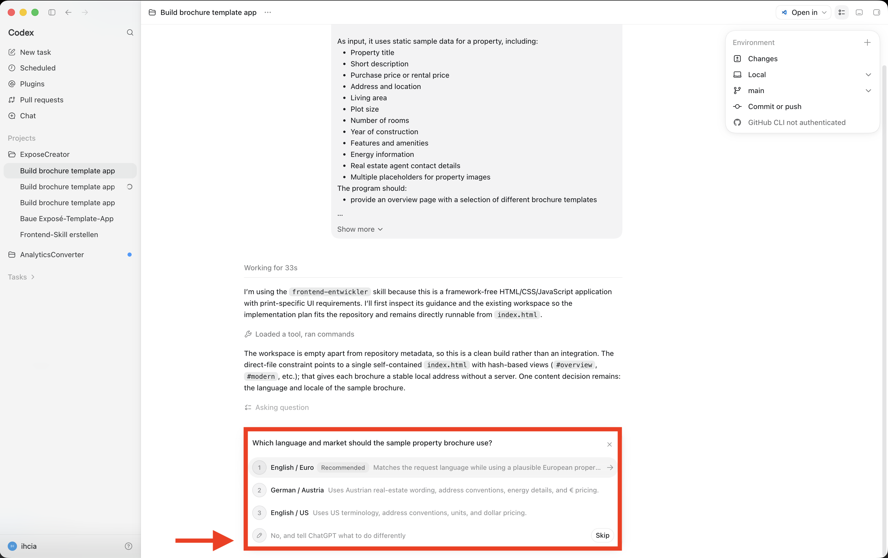

Speaker notes: Plan Mode can pause to ask targeted questions when an important requirement is unclear. Choose an option or give your own answer so Codex can build the plan around the right assumptions.

## Slide 16: Implement the plan

_Step 3 of 3 — Review the plan and confirm implementation_

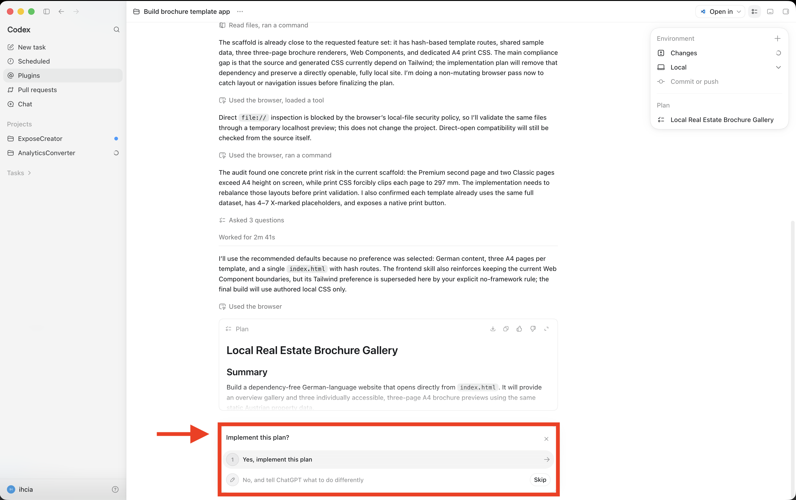

Speaker notes: Review the plan summary, scope, and assumptions before continuing. Choose Yes, implement this plan only when the proposed approach matches the task.

## Slide 17: Skill

_What it is · Why it helps · How to use it_

A skill is a reusable playbook that teaches Codex how to perform one specific type of task.

| Question | Answer |
| --- | --- |
| What is it? | Instructions, references, and checks for a focused task |
| Why use it? | More consistent results with less repeated prompting |
| How do I use it? | Use it for a repeatable task; mention `$skill-name` or let Codex match it |

Security: Read a skill before trusting it. Prefer focused skills from trusted sources and check what tools, files, or external services they expect to use.

## Slide 18: Create a skill with Skill Creator

_Select the skill and describe the task_

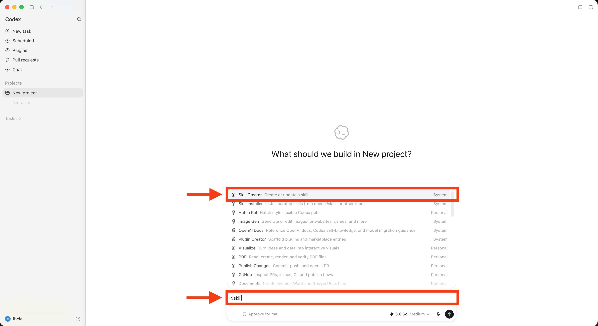

Speaker notes: Enter `$skill`, select Skill Creator, and describe one focused task, its trigger, and the expected result. Review and test the generated skill before using it.

## Slide 19: Describe what the skill should do

_Name the skill, define its trigger, and set clear constraints_

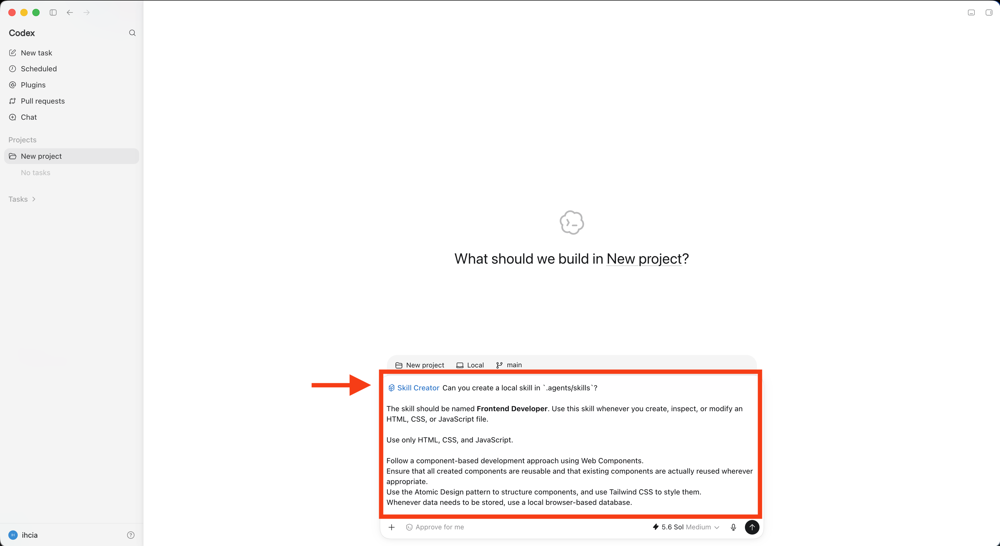

Speaker notes: A useful request names the skill, explains when it should activate, and states the standards or constraints it must follow.

## Slide 20: Open the generated skill

_Skill Creator creates and validates the local files_

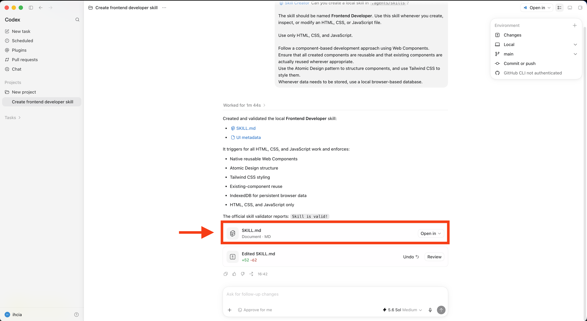

Speaker notes: After creation, check that Codex reports the skill as valid and open the generated files for review.

## Slide 21: Check the skill metadata

_openai.yaml defines how the skill appears and starts_

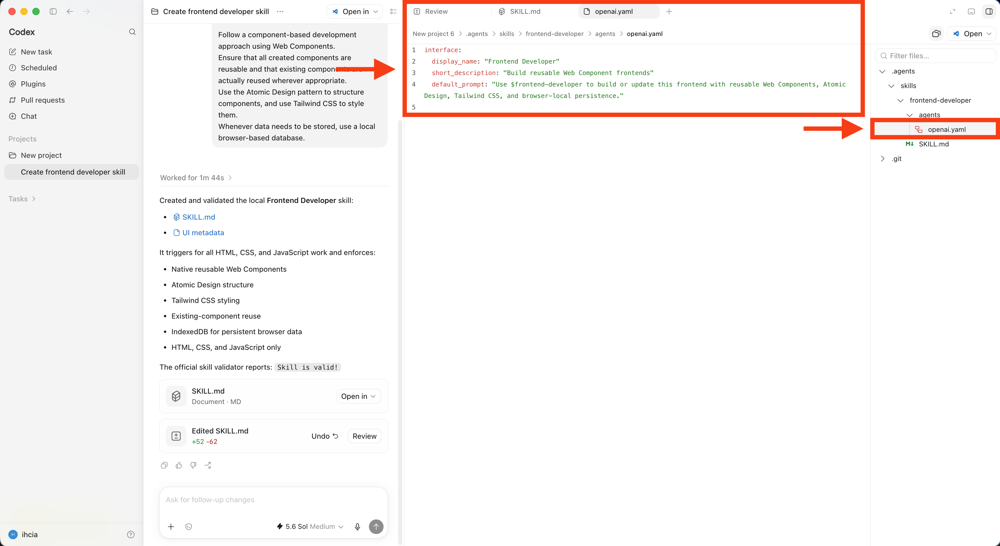

Speaker notes: Review the display name, short description, and default prompt in `agents/openai.yaml`. They should make the skill easy to recognize and use.

## Slide 22: Review the skill instructions

_SKILL.md defines the trigger, workflow, and constraints_

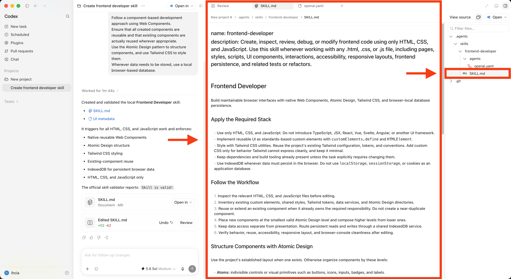

Speaker notes: Read the complete `SKILL.md` before using the skill. Check that the trigger is precise and that the instructions are ordered, focused, and testable.

## Slide 23: A good skill is focused and testable

_Local required core, optional support_

```text
my-skill/
├── SKILL.md                 required
├── agents/
│   └── openai.yaml          required for local skills
├── references/
│   └── some.md              optional deep context
└── scripts/                 optional deterministic helpers
```

Quality check:

- One clearly scoped job
- Precise trigger description
- Explicit inputs and outputs
- Imperative, ordered steps
- Examples and checks only where useful

Rule: Local standard: Always include `SKILL.md` and `agents/openai.yaml`. Add references and scripts only when the workflow needs them.

Speaker notes: For local workshop skills, `agents/openai.yaml` is required alongside `SKILL.md`. In the general Codex skill format, this metadata file is optional. Keep references separate so Codex can use progressive disclosure.

## Slide 24: Tool

_What it is · Why it helps · How to use it_

A tool is a program or interface Codex can use to retrieve information or perform a task.

| Question | Answer |
| --- | --- |
| What is it? | Programs such as Browser, Terminal, and Excel; services such as GitHub, Google Drive, and Slack |
| Why use it? | To find, read, and check information or complete tasks inside other programs |
| How do I use it? | Choose the tool that matches the task, check its access, and review the result |

Security: Tools make risk real. Review anything that deletes, publishes, sends messages, installs software, calls external services, or shares data.

## Slide 25: Install a plugin

_Open Plugins -> Review access -> Install_

Visual: One large, complete Codex screenshot showing the plugin directory, Install button, and data-access warning.

Speaker notes: Plugins are installable bundles. Review requested access before installation. In the CLI, run `/plugins`, install from a configured marketplace, and start a new session.

## Slide 26: Open the plugin details before installing

_Choose the plugin you want to review_

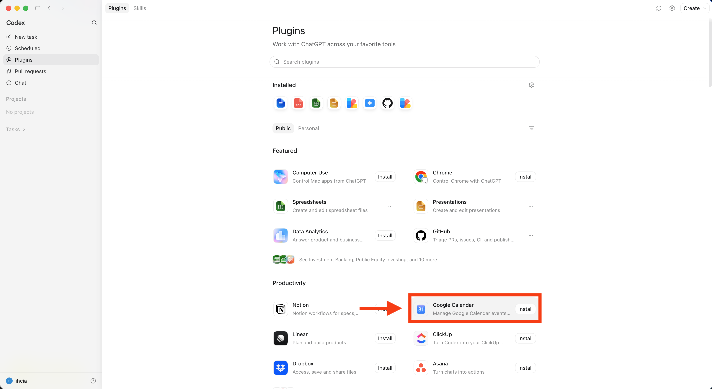

Speaker notes: Do not install from the directory view alone. Open the plugin detail page so you can inspect what the bundle contains and what it can access.

## Slide 27: Check what the plugin includes

_Review every app and skill in the bundle_

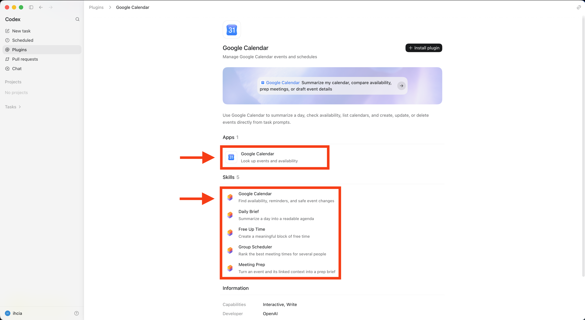

Speaker notes: A plugin can bundle apps and skills. Review each included capability rather than judging the plugin only by its name or summary.

## Slide 28: Inspect the app's actions

_Pay special attention to write and delete actions_

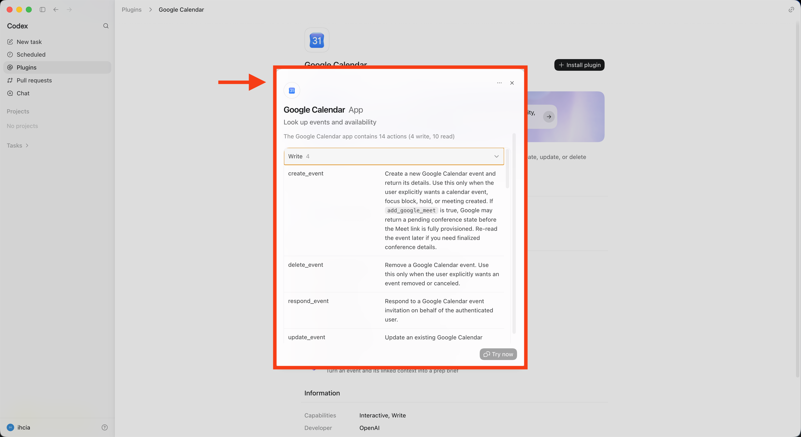

Speaker notes: Check which actions only read information and which can create, update, delete, or send data. Grant access only when those actions are necessary for your task.

## Slide 29: Read the included skill before use

_Check its workflow, boundaries, and expected output_

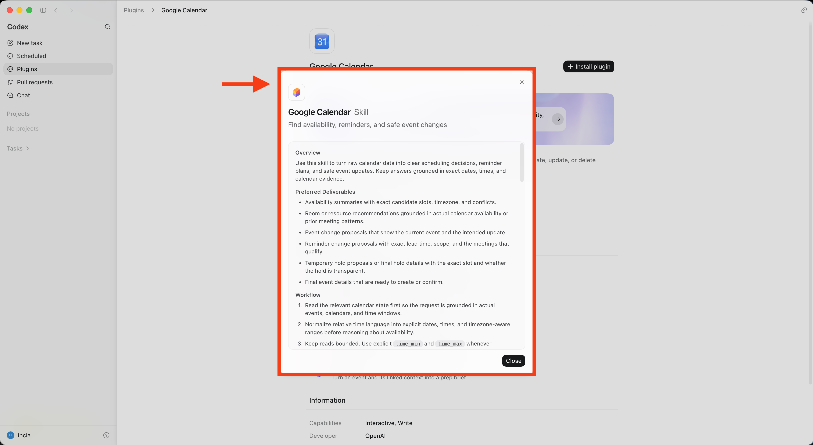

Speaker notes: Read the skill instructions before trusting them. Check that the workflow is relevant, the boundaries are safe, and the expected outputs match your task.

## Slide 30: Skill or plugin? Choose by the need

_Process = Skill · Connected tool or information = Plugin_

### Skill

- Teaches Codex your repeatable process
- Use for consistent rules, order, tone, or format
- Start with `$` and select the skill
- Example: create a weekly update in your team's format

### Plugin

- Connects Codex to other tools and information
- Use for Google Drive, email, or another service
- Open Plugins, review access, and install
- Example: pull the latest project files from Google Drive

Use both: Combine a skill and a plugin when your process needs information from a connected tool.

Speaker notes: Source: [OpenAI Academy — Plugins and skills](https://openai.com/academy/codex-plugins-and-skills/). OpenAI Academy's rule of thumb: use a plugin for information from another tool, a skill for your process, and both when the process uses connected information.

## Slide 31: Top 10 AI Safety Tips

_Simple rules for everyday work_

### 10 simple rules

1. Use approved material — use your company's images instead of copying from Google
2. Share as little as possible — remove customer names, addresses, and private notes
3. Keep passwords private — never paste passwords or access codes into an AI chat
4. Open only what is needed — share one campaign folder, not the whole drive
5. Check connected apps — know what an AI tool can read, change, or send
6. Let a person make final decisions — check before sending, publishing, deleting, or spending money
7. Do not trust every instruction — a file or website may try to trick the AI into sharing information
8. Check the result — verify names, facts, prices, dates, links, sources, and brand tone
9. Try it on a copy first — preview the campaign and keep a backup before changing the original
10. Stop when something feels wrong — disconnect the tool, change exposed passwords, and tell the responsible person

Speaker note: These rules are for everyday marketing work. The main idea: share less, check access, keep final decisions with a person, review AI results, and stop when something looks wrong.

## Slide 32: Summary: Projects & Plan Mode

_Workspace and planning words_

| Word | Meaning | Metaphor |
| --- | --- | --- |
| Project | A dedicated workspace with the files, context, and rules for one area of work. | 🏪 Restaurant |
| Access mode | Controls what the agent may do and when it must ask for approval. | 🔑 Kitchen key |
| Files and folders | The focused task material shared with Codex as context. | 🧺 Ingredient basket |
| Plan Mode | Lets Codex gather context, ask questions, and propose a plan before implementation. | 📝 Preparation plan |
| Clarifying question | Resolves an important missing decision before work starts. | 🙋 Chef asks the guest |
| Implement plan | Starts the work after the proposed approach has been reviewed. | ▶️ Start cooking |

## Slide 33: Summary: Skills & Tools

_Reusable processes and capabilities_

| Word | Meaning | Metaphor |
| --- | --- | --- |
| Skill | A reusable playbook that teaches Codex how to perform a focused task. | 📘 Recipe card |
| SKILL.md | The main file containing the skill's trigger, workflow, and constraints. | 📖 Recipe |
| openai.yaml | Metadata that controls how a local skill appears and starts. | 🏷️ Recipe label |
| Tool | A program or interface Codex can use to retrieve information or take action. | 🛠️ Kitchen tool |
| Plugin | An installable bundle that can provide apps, skills, and connected capabilities. | 🧰 Toolbox |
| App action | A connected operation that can read, create, update, delete, or send data. | 🔌 Connected appliance |
| Skill + plugin | A repeatable process that uses information or actions from another tool. | 📘 Recipe + pantry |

## Slide 34: Summary: Safe Work

_Everyday safety rules and metaphors_

| Rule | What it means | Metaphor |
| --- | --- | --- |
| Use least access | Choose the narrowest access that still allows the task. | 🔑 One kitchen key |
| Share minimum context | Add only the files and folders the task genuinely needs. | 🥕 Ingredients for one dish |
| Use trusted sources | Review skills, plugins, instructions, and requested access before use. | ✅ Approved supplier |
| Keep human approval | A person decides before sending, publishing, deleting, or spending money. | 🧑‍🍳 Head chef signs off |
| Verify the result | Check facts, names, prices, dates, links, sources, and brand tone. | 👅 Taste test |
| Test on a copy | Preview changes and keep a backup before touching the original. | 🍽️ Practice plate + spare |
| Stop and report | Disconnect the tool and tell the responsible person when something looks wrong. | 🛑 Emergency stop |
