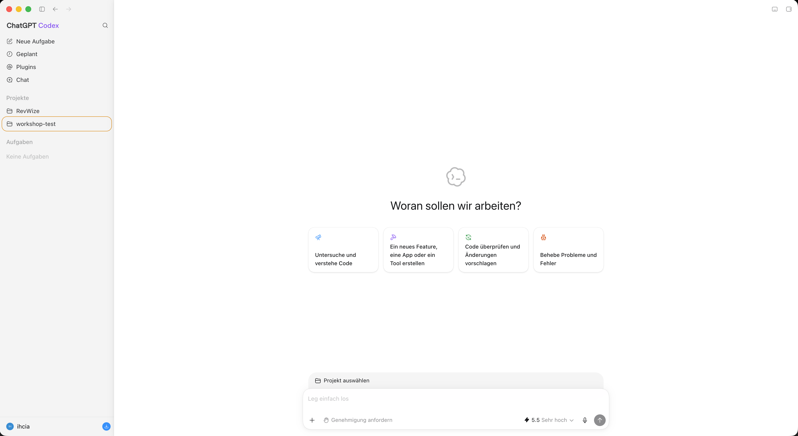
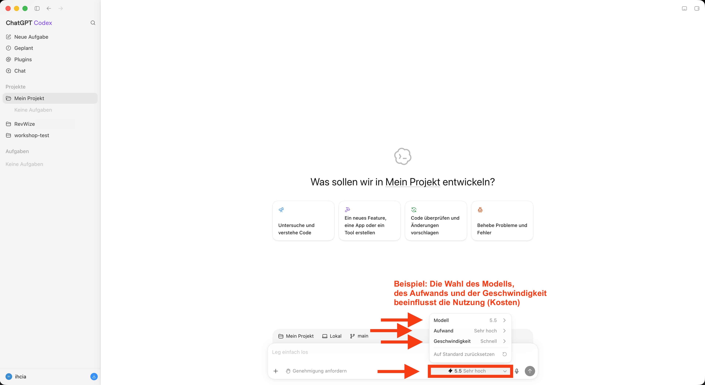
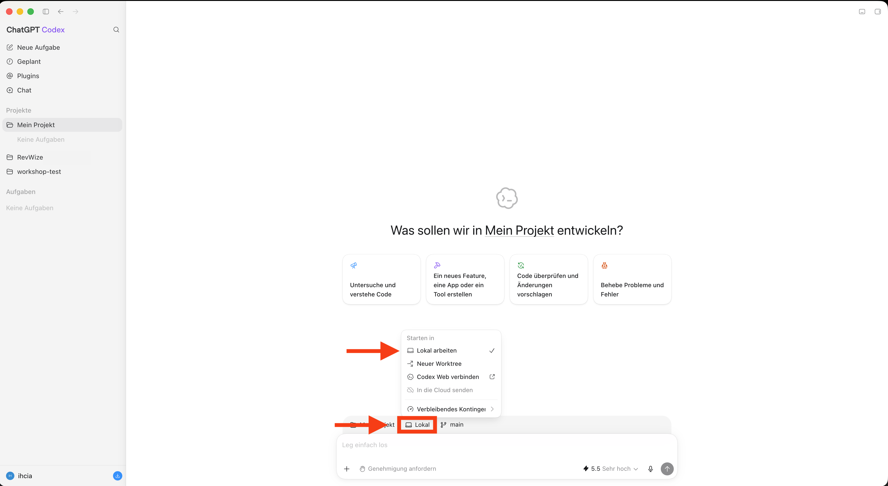
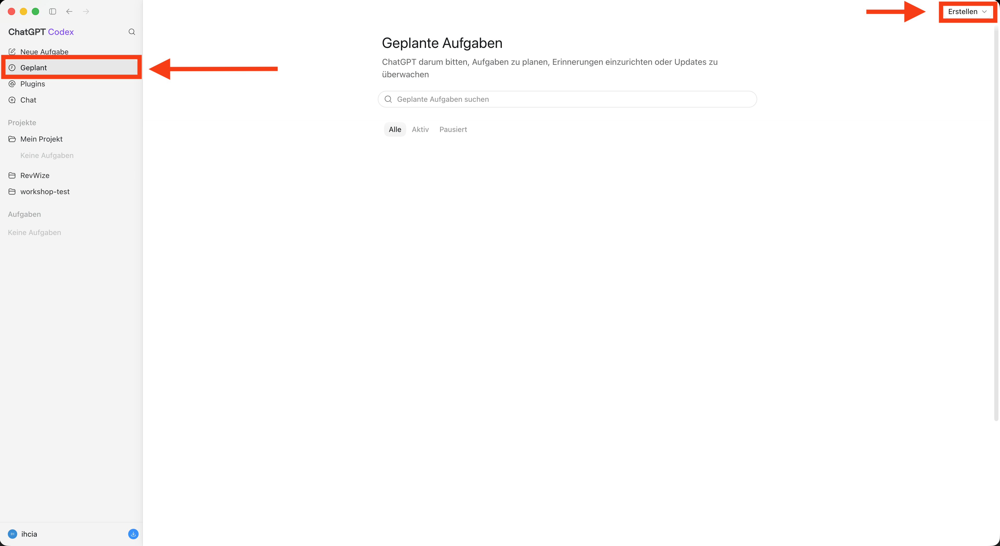
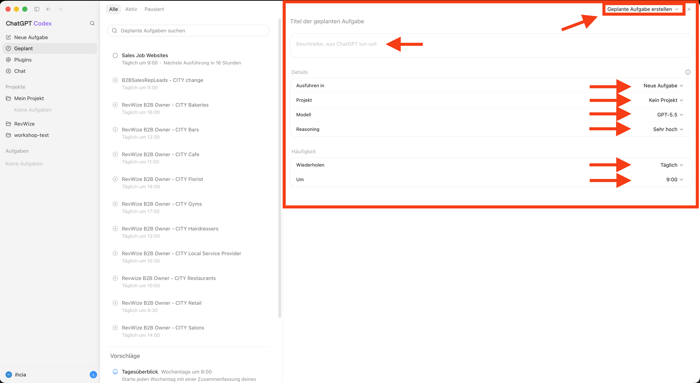
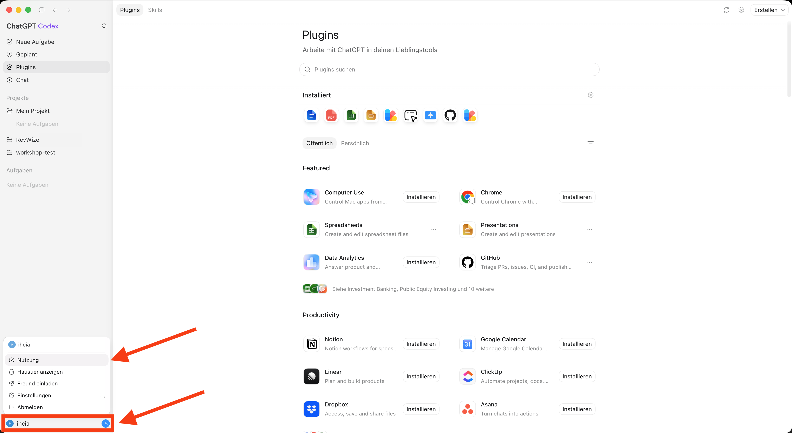
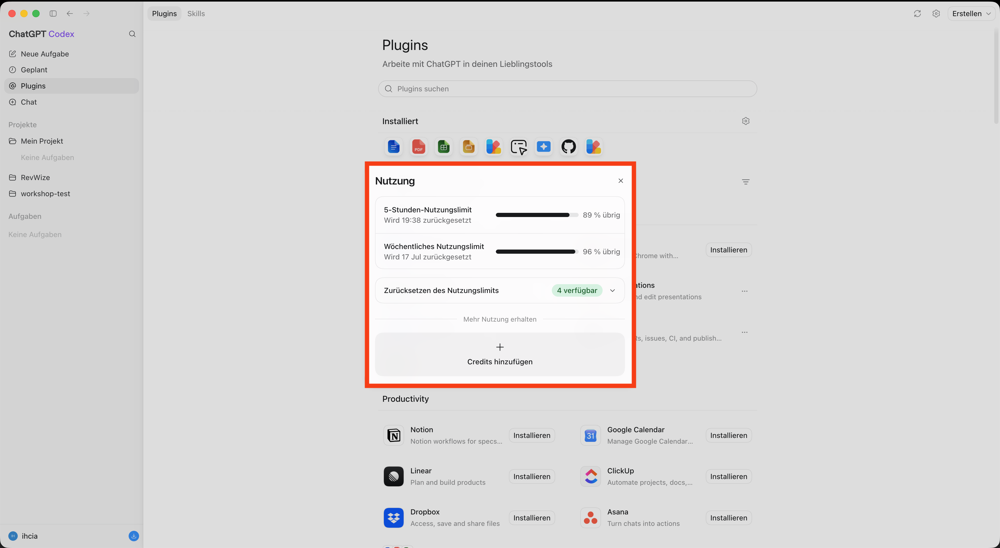

# Agentic Coding für kreative Teams

## Slide 1: Agentic Coding für kreative Teams

_Von Chatbots zu Agenten im kreativen Arbeitsalltag_

Speaker notes: Halte es einfach. Ziel ist, Angst abzubauen und die Neugierlücke zu schließen.

## Slide 2: Lukas Aichbauer

_Über mich_

- Co-Founder @ PebbleByte GmbH
- Lecturer @ Technikum Wien

- [lukas@pebblebyte.com](mailto:lukas@pebblebyte.com)
- [/in/aichbauer](https://www.linkedin.com/in/aichbauer)

## Slide 3: Wer seid Ihr?

**Arbeitsbereich**

In welchem Bereich arbeitet ihr?

**AI-Erfahrung**

Welche Erfahrung habt ihr mit AI?

**Erwartungen**

Was erwartet ihr von diesem Workshop?

[Zum Vorstellungsboard](https://excalidraw.com/#room=b865e3e0b6ae59e06db4,t2my8u5vBfupgW9RRFdYWw)

## Slide 4: Wofür nutzen wir KI-Agenten?

**Websites entwickeln**

Wir entwickeln und verbessern die DevOpsCycle-Website mit KI-Agenten.

- [devopscycle.com](https://devopscycle.com)

**Vertriebspartner finden**

Wir recherchieren Agenturen in Österreich, Deutschland und der Schweiz, die RevWize über unser Partnermodell verkaufen könnten.

- [revwize.com](https://revwize.com)
- [Partner-Leads · Excel-Demo](../src/assets/showcases/revwize-partner-leads-demo.xlsx)

**Marketingmaterial erstellen**

Wir erstellen Cheat Sheets, Produktinfoseiten und Präsentationen für den Vertriebspartner-Pitch per Prompt.

- [Docker Cheat Sheet · Bild](../src/assets/showcases/ultimate-docker-cheat-sheet.webp)
- [RevWize-Infoseiten · PDF](../src/assets/showcases/revwize-partner-info-de.pdf)
- [Partner-Pitch · PDF](../src/assets/showcases/revwize-partner-pitch.pdf)

## Slide 5: Drei Starter-Ideen

**Marketing**

Kundenbewertungen enthalten starke Marketing-Sprache, werden aber selten systematisch analysiert.

Review-Mining-App: sammelt Reviews aus G2, Trustpilot, App Store, Amazon oder Support-Tickets und extrahiert Pain Points, Nutzenversprechen, Einwände und wiederverwendbare Formulierungen.

**Designer:innen**

Desktop-, Tablet- und Mobile-Layouts zu prüfen kostet regelmäßig Zeit und viel manuelle Aufmerksamkeit.

Responsive-Screenshot-Reviewer: URL eingeben, Breakpoint-Screenshots erzeugen und Overflow, kaputte Layouts, winzige Schrift oder abgeschnittene Buttons markieren.

## Slide 6: Starter-Idee: Projektmanagement

**Projektmanagement**

Anforderungen, User Flows und Akzeptanzkriterien bleiben oft unterschiedlich interpretierbar.

Prototype-as-Acceptance-App: macht aus einem Briefing einen Browser-Prototypen mit User Flows, Zuständen, Edge Cases und Akzeptanzkriterien als ausführbare Entwickler:innen-Referenz.

[Small example](https://excalidraw.com/#room=ea1db8fc739eedf79aa2,UVhiaqFZYp8kMExx7z64zA)

## Slide 7: Was wir behandeln

_Agenda_

- LLMs, Chatbots, Agenten und Agentic Coding
- AI-Agenten-Landschaft und Codex-Setup
- Einen guten ersten Use Case finden
- Übungen: Input, Schritte, Regeln, Auftragsdesign und Fehlerfälle

## Slide 8: LLM / Chatbot / Agent

_Vom Gehirn zur Handlung_

**Large Language Model (LLM)**

Computerprogramm

Metapher: Gehirn

**Chatbot**

Gesprächsoberfläche

Metapher: Augen, Ohren, Mund

**Agent**

Nutzt Tools und handelt

Metapher: Hände, Arme, Füße

## Slide 9: LLM

_Input -> LLM (Computerprogramm) -> Output_

So kann man sich grob vorstellen, was in einem Large Language Model passiert.

**Input**

- Satzanfang: "Der Himmel ist ..."

**LLM**

- "blau" -> 0,87
- "bewölkt" -> 0,09
- "grün" -> 0,04

**Output**

- "Der Himmel ist blau."

## Slide 10: LLM: Die Kernidee

**Ganz grob**

Es versteht nicht wie ein Mensch. Es nutzt Muster aus vielen Texten, um passende nächste Tokens vorherzusagen. Tokens sind kleine Textstücke: Wortteile, ganze Wörter oder Buchstabenketten.

## Slide 11: Chatbot

_Mensch -> Webseite -> Server mit LLM -> Antwort_

Ein Chatbot ist eine Webseite oder App, die deine Nachricht an ein LLM schickt und die Antwort anzeigt.

**Mensch**

- Tippt eine Frage oder Aufgabe

**Webseite**

- Chatbot-Seite oder App

**Server + LLM**

- Sagt Tokens voraus und baut Text

**Antwort**

- Computer zeigt die Antwort

**Ganz grob**

Der Chatbot ist die Oberfläche und Verbindung. Das LLM läuft meistens auf einem Server; dein Computer zeigt das Gespräch.

## Slide 12: Agent

_Ziel -> Agent (LLM + Programme) -> Ergebnis_

Ein Agent bekommt ein Ziel und kann Tools benutzen, um Schritte auszuführen.

**Ziel**

- Aufgabe: "Füge zwei Folien hinzu und prüfe das Deck."

**Agent**

- Spricht mit LLM
- Nutzt Programme: PowerPoint, Google Slides, Browser
- Liest und ändert Dateien
- Prüft das Ergebnis

**Ergebnis**

- Geändertes Deck plus kurze Zusammenfassung

## Slide 13: Agent: Die Kernidee

_Ziel -> Agent (LLM + Programme) -> Ergebnis_

**Ganz grob**

Ein Agent hört nicht bei einer Textantwort auf. Er kann Schritte planen, Tools verwenden, Dateien lesen und bearbeiten, Ergebnisse prüfen und weiterarbeiten, bis die Aufgabe erledigt ist.

## Slide 14: Vom Rezept zum Chef

_Prompting / Vibe Coding / Agentic Coding_

Gleiche KI, aber anders gesteuert: fragen, improvisieren oder Umsetzung führen.

**Prompting**

- Du fragst im Chat und bekommst eine Antwort
- Du entscheidest selbst, was du damit machst
- Metapher: Rezept anfragen

**Vibe Coding**

- Du beschreibst die App grob und kopierst Code hin und her
- Starten, anschauen, nach Gefühl anpassen
- Metapher: "Irgendwas mit Pasta"

**Agentic Coding**

- Du gibst Ziel, Kontext, Dateien und Grenzen
- Agent plant, ändert, testet und verbessert
- Metapher: Chef in der Küche

## Slide 15: Vom Rezept zum Chef: Kernidee

_Prompting / Vibe Coding / Agentic Coding_

**Kernidee**

Prompting fragt, Vibe Coding probiert. Beim Agentic Coding gibst du Ziel und Kontext vor – der Agent plant, setzt um und prüft, du gibst Feedback und entscheidest.

## Slide 16: AI-Agenten-Landschaft

_Sechs Beispiele mit unterschiedlichen Anwendungsfällen und Gebieten_

- Codex
- Claude Code
- Qwen Code
- Mistral Vibe Code
- Zapier Agents
- OpenClaw

## Slide 17: Codex installieren

_Setup_

[https://openai.com/codex/](https://openai.com/codex/)

## Slide 18: Codex zuerst öffnen

_Start_

## Slide 19: Anmelden

_Erstes Öffnen_

## Slide 20: Anmeldung fortsetzen

_Erstes Öffnen_

## Slide 21: Anmeldung erfolgreich

_Erstes Öffnen_

## Slide 22: Codex Startseite

_Nach dem ersten Login_

## Slide 23: Neues Projekt erstellen

_Projekt-Setup_

## Slide 24: Projekt benennen

_Projekt-Setup_

## Slide 25: Projekt auswählen

_Wo das Projekt ausgewählt wird_

## Slide 26: Kleiner Selbstversuch – Coding

_Bevor wir mit eigenen Use Cases starten_

**Mini Todo List App**

Eine einfache Aufgabenliste mit Hinzufügen, Abhaken, Löschen und leerem Zustand.

Gut, um Formulare, Listen, Zustände und kleine Datenmodelle greifbar zu machen.

**Landing Page clonen**

Eine Landing Page anhand eines Screenshots nachbauen.

Gut, um Layout, Typografie, Farben, Abstände und responsive Details zu trainieren.

[Ideen](https://excalidraw.com/#room=fae440cad3935c8cd21e,5SXK_ml_xSQCC_sP_CaovQ)

## Slide 27: Kleiner Selbstversuch – Alltagsoperationen

_Bevor wir mit eigenen Use Cases starten_

**Im Browser recherchieren**

Besuche drei Eventlocations im Browser und vergleiche Kapazität, Lage und Kontaktdaten.

Übe das Navigieren auf Websites und das Sammeln von Ergebnissen mit Quellenlinks.

**Eine E-Mail senden**

Formuliere aus drei Stichpunkten eine E-Mail, trage deine eigene Adresse ein, prüfe den Entwurf und sende ihn ab.

Übe das Bedienen einer Mail-App und das Prüfen von Empfänger, Betreff und Nachricht.

## Slide 28: OpenAI-Modelle im Überblick

_GPT-6 & GPT-5.6 · Berufsalltag & kreative Aufgaben · Stand: 16.09.2026_

| Modell | Fokus / typische Anwendungen | Reasoning-Aufwand |
| --- | --- | --- |
| GPT-6 Astra | Anspruchsvollste Aufgaben | low → max |
| GPT-5.6 Sol | Komplexe professionelle Arbeit | none → max |
| GPT-5.6 Terra | Balance aus Qualität und Kosten | none → max |
| GPT-5.6 Luna | Günstig bei hohem Volumen | none → max |

Reasoning = wie viel Aufwand das Modell ins Durchdenken deiner Aufgabe steckt. Kurz umformulieren braucht wenig; Optionen anhand mehrerer Anforderungen abzuwägen kann von mehr profitieren. Mehr Aufwand kann länger dauern. none = aus; low → max = wenig bis maximal.

Speaker notes: Ausgewählte API-Modelle; die Verfügbarkeit in der Codex-Modellauswahl kann abweichen. Kontextangaben sind API-Limits. Die Pfeile kürzen die unterstützten Stufen ab. GPT-6 Astra: low, medium, high, xhigh, max. GPT-5.6 Sol/Terra/Luna: none, low, medium, high, xhigh, max. none = aus, low = gering, medium = mittel, high = hoch, xhigh = sehr hoch, max = maximal. Quelle: https://developers.openai.com/api/docs/models
Die typischen Anwendungen sind Beispiele, abgeleitet aus der offiziellen Modellausrichtung: Astra für anspruchsvollste Aufgaben über viele Schritte, Sol für komplexe professionelle Arbeit, Terra für die Balance aus Leistungsfähigkeit und Kosten, Luna für kostensensitive Aufgaben mit hohem Volumen. Es sind keine exklusiven Fähigkeiten oder benchmarkbasierten Aufgaben-Ranglisten.

## Slide 29: OpenAI-Modelle: Kontext und Wissen

_GPT-6 & GPT-5.6 · Berufsalltag & kreative Aufgaben · Stand: 16.09.2026_

| Modell | Kontext (Tokens) | Max. Output (Tokens) | Wissensstand |
| --- | --- | --- | --- |
| GPT-6 Astra | 1,05 Mio. | 128.000 | 30.04.2026 |
| GPT-5.6 Sol | 1,05 Mio. | 128.000 | 16.02.2026 |
| GPT-5.6 Terra | 1,05 Mio. | 128.000 | 16.02.2026 |
| GPT-5.6 Luna | 1,05 Mio. | 128.000 | 16.02.2026 |

Kontext = was gleichzeitig auf den Schreibtisch des Modells passt: Gespräch, Briefing und Dokumente. Tokens sind kleine Textbausteine; Mio. = Millionen. Wissensstand = Stichtag des eingebauten Modellwissens; neuere Fakten brauchen aktuelle Quellen.

Speaker notes: Ausgewählte API-Modelle; die Verfügbarkeit in der Codex-Modellauswahl kann abweichen. Kontextangaben sind API-Limits. Die Pfeile kürzen die unterstützten Stufen ab. GPT-6 Astra: low, medium, high, xhigh, max. GPT-5.6 Sol/Terra/Luna: none, low, medium, high, xhigh, max. none = aus, low = gering, medium = mittel, high = hoch, xhigh = sehr hoch, max = maximal. Quelle: https://developers.openai.com/api/docs/models
Die typischen Anwendungen sind Beispiele, abgeleitet aus der offiziellen Modellausrichtung: Astra für anspruchsvollste Aufgaben über viele Schritte, Sol für komplexe professionelle Arbeit, Terra für die Balance aus Leistungsfähigkeit und Kosten, Luna für kostensensitive Aufgaben mit hohem Volumen. Es sind keine exklusiven Fähigkeiten oder benchmarkbasierten Aufgaben-Ranglisten.

## Slide 30: OpenAI-Modelle: API-Preise

_GPT-6 & GPT-5.6 · Berufsalltag & kreative Aufgaben · Stand: 16.09.2026_

| Modell | Input (USD / Mio.) | Output (USD / Mio.) |
| --- | --- | --- |
| GPT-6 Astra | $10,00 | $50,00 |
| GPT-5.6 Sol | $4,00 | $20,00 |
| GPT-5.6 Terra | $2,00 | $12,00 |
| GPT-5.6 Luna | $0,20 | $1,20 |

Preise in USD pro 1 Mio. Tokens: API-Standardtarif bei kurzem Kontext und ungecachtem Input. Input = gesendetes Material; Output = erzeugte Tokens. Langer Kontext kostet mehr.

[Quellen: OpenAI-Modellkatalog](https://developers.openai.com/api/docs/models)

[OpenAI-API-Preise (USD / 1 Mio. Tokens)](https://developers.openai.com/api/docs/pricing)

Speaker notes: Ausgewählte API-Modelle; die Verfügbarkeit in der Codex-Modellauswahl kann abweichen. Kontextangaben sind API-Limits. Die Pfeile kürzen die unterstützten Stufen ab. GPT-6 Astra: low, medium, high, xhigh, max. GPT-5.6 Sol/Terra/Luna: none, low, medium, high, xhigh, max. none = aus, low = gering, medium = mittel, high = hoch, xhigh = sehr hoch, max = maximal. Quelle: https://developers.openai.com/api/docs/models
Die typischen Anwendungen sind Beispiele, abgeleitet aus der offiziellen Modellausrichtung: Astra für anspruchsvollste Aufgaben über viele Schritte, Sol für komplexe professionelle Arbeit, Terra für die Balance aus Leistungsfähigkeit und Kosten, Luna für kostensensitive Aufgaben mit hohem Volumen. Es sind keine exklusiven Fähigkeiten oder benchmarkbasierten Aufgaben-Ranglisten.

## Slide 31: Wie funktioniert Reasoning?

_Ein interner Arbeitsentwurf vor der Antwort_

Das Modell erzeugt interne Reasoning-Tokens: Zwischenschritte, die für dich normalerweise unsichtbar bleiben.

**Damit kann es**

- Die Aufgabe in kleinere Schritte zerlegen.
- Lösungswege vergleichen und Zwischenergebnisse prüfen.
- Einen Ansatz überarbeiten und die Antwort entwickeln.

Mehr Reasoning = mehr Rechenaufwand für diese Schritte. Das kann bei schwierigen Aufgaben helfen und länger dauern; richtige Antworten sind nicht garantiert.

[Quelle: OpenAI – Reasoning](https://developers.openai.com/api/docs/guides/reasoning)

Speaker notes: Vereinfachte Erklärung des dokumentierten Ablaufs. Interne Reasoning-Tokens sind nicht direkt einsehbar; angezeigte Zusammenfassungen sind nicht der vollständige interne Prozess. Reasoning kann auch zwischen Tool-Aufrufen stattfinden. Quelle: https://developers.openai.com/api/docs/guides/reasoning

## Slide 32: Reasoning und Agenten

_Ein interner Arbeitsentwurf vor der Antwort_

**Reasoning & Agenten**

Reasoning ist eine Fähigkeit des Modells, Aufgaben zu durchdenken. Ein Agent nutzt ein Modell und Werkzeuge, um zu handeln, Ergebnisse zu prüfen und weiterzuarbeiten.

Beispiel: Reasoning hilft, ein Kampagnenbudget abzuwägen. Ein Agent kann zusätzlich die Budgetdatei öffnen und den Plan als Dokument speichern.

Speaker notes: Vereinfachte Erklärung des dokumentierten Ablaufs. Interne Reasoning-Tokens sind nicht direkt einsehbar; angezeigte Zusammenfassungen sind nicht der vollständige interne Prozess. Reasoning kann auch zwischen Tool-Aufrufen stattfinden. Quelle: https://developers.openai.com/api/docs/guides/reasoning

## Slide 33: Modell auswählen

_Wo das Modell ausgewählt wird_

## Slide 34: Workspace auswählen

_Wo der Agent arbeitet_

## Slide 35: Plugins einbinden

_Verfügbare Tools_

## Slide 36: Was ist eine Automation?

_Aufgaben nach Zeitplan_

Eine Automation startet eine festgelegte Aufgabe automatisch, sobald ihr Auslöser eintritt.

Beispiel: ein Wochenbericht

**Zeitplan**

09:00
Jeden Montag

**Aufgabe**

Projektstand zusammenfassen
Der Agent folgt deinen Anweisungen

**Ergebnis**

Wochenbericht
Bereit zum Prüfen

Nächsten Montag um 09:00 wiederholen

Einmal einrichten. Bei jedem Termin automatisch ausführen.

Speaker notes: Die Uhrzeit ist ein Beispiel, keine tatsächlich laufende Automation. Auslöser, gespeicherte Anweisungen und Ergebnis erklären. Der Rückpfeil bedeutet einen neuen Durchlauf zum nächsten Termin, keine dauerhaft laufende Aufgabe. Andere Automationen können statt nach Zeitplan auch durch ein Ereignis starten.

## Slide 37: Automations erstellen

_Automation-Setup_

## Slide 38: Automations konfigurieren

_Automation-Setup_

## Slide 39: Tägliche Recherche

_Automatisch jeden Tag um 09:00 Uhr_

**Wettbewerbsrecherche**

Prüfe die Websites ausgewählter Wettbewerber auf neue Produkte, Preisänderungen und Kampagnen.

Ergebnis: ein kurzer Überblick über Änderungen seit dem letzten Durchlauf, mit Quellenlinks.

**Kundenrecherche**

Prüfe die Websites ausgewählter Kunden und öffentliche Nachrichten auf Ankündigungen, Projekte und Veränderungen im Unternehmen.

Ergebnis: ein kurzer Überblick pro Kunde, mit Quellenlinks und möglichen Themen für das nächste Gespräch.

## Slide 40: Usage finden

_Account Usage_

## Slide 41: Usage Details

_Account Usage_

## Slide 42: Welche Use Cases eignen sich für den Einstieg?

_Klein starten, echten Nutzen erzeugen_

| Ein guter erster Use Case ist | Woran man es erkennt |
| --- | --- |
| häufig | die Aufgabe kommt regelmäßig vor |
| zeitaufwendig | sie bindet spürbar Aufmerksamkeit |
| klar prüfbar | ein gutes Ergebnis ist erkennbar |
| risikoarm | Fehler lassen sich leicht entdecken und korrigieren |
| kontextreich | Beispiele, Dateien und Regeln sind vorhanden |

## Slide 43: Use-Case-Board

_Excalidraw_

[Find your usecase](https://excalidraw.com/#room=3f7fb564ea3a699c6fd3,sDK2_w9L9RRcSUgP1PYFTA)

## Slide 44: Übung 1: Input und Output definieren

_Dauer: 5 Minuten_

**Fragen**

- Was bekommt das Programm?
- In welchem Format?
- Was soll es erzeugen?
- Wie soll das Ergebnis aussehen?

| Input | Output |
| --- | --- |
| Datei | Zusammenfassung oder Report |
| Notizen | Aufgabenliste |
| URL | Screenshots und Fehler |
| CSV-Tabelle | Themen und Beispiele |

**Beispiele:** Input kann eine Datei, eine Notiz, eine URL, eine CSV-Datei oder anderes Material sein.

## Slide 45: Übung 2: Den Prozess zerlegen

_Dauer: 5 Minuten_

Ziel: Die Aufgabe in kleine, klare Schritte aufteilen, denen ein Agent folgen kann.

**Allgemeines Beispiel**

1. Input auswählen: Welche Datei, Notiz oder Website soll bearbeitet werden?
2. Input öffnen: Die Datei laden oder die Website aufrufen und den Inhalt lesen.
3. Informationen sammeln: Die Angaben heraussuchen, die für die Aufgabe wichtig sind.
4. Regeln anwenden: Die Angaben nach deinen Vorgaben prüfen, sortieren oder bearbeiten.
5. Ergebnisse sammeln: Die Resultate zusammenstellen und fehlende oder unklare Angaben markieren.
6. Output erstellen: Das Ergebnis als Liste, CSV-Datei, Excel-Tabelle oder PowerPoint-Präsentation ausgeben, per E-Mail senden oder als Website aufbereiten.

## Slide 46: Übung 3: Regeln und Beispiele sammeln

_Dauer: 5 Minuten_

Schreibt 3–5 konkrete Regeln auf: Was muss das Ergebnis enthalten, wie soll es aussehen und was darf nicht passieren?

**Welche Regeln braucht ihr?**

- Inhalt: Welche Angaben müssen enthalten sein?
- Format: Liste, Tabelle oder Fließtext? Wie lang?
- Sprache: Welcher Ton, welche Begriffe?
- Fehlende Angaben: Nachfragen, markieren oder überspringen?
- Prüfung: Wie sieht ein gutes und ein schlechtes Ergebnis aus?

**Allgemeine Regeln**

- Übernimm alle geforderten Angaben. Erfinde keine Informationen.
- Halte das vereinbarte Format, die Reihenfolge und die maximale Länge ein.
- Schreibe verständlich und verwende die vereinbarte Sprache und Ansprache.
- Markiere fehlende oder unklare Angaben und frage bei Bedarf nach.
- Prüfe das Ergebnis auf Vollständigkeit, Widersprüche und übrig gebliebene Platzhalter.

## Slide 47: Zusammenfassung: Basics

_Wichtige Wörter und Metaphern_

| Wort | Bedeutung | Metapher |
| --- | --- | --- |
| LLM | Ein Sprachmodell, das aus Input passende nächste Textstücke vorhersagt. | 🧠 Gehirn |
| Token | Ein kleines Textstück: Wortteil, ganzes Wort oder Zeichenkette. | 🧩 Text-Baustein |
| Chatbot | Eine Oberfläche, die Nachrichten an ein LLM schickt und Antworten zeigt. | 👀👂👄 Augen, Ohren, Mund |
| Agent | Ein LLM-basiertes System, das Tools nutzen, handeln, prüfen und weitermachen kann. | 🤲💪🦵 Hände, Arme, Füße |
| Prompting | Im Chat fragen und selbst entscheiden, was man mit der Antwort macht. | 📖 Rezept anfragen |
| Vibe Coding | Software grob beschreiben, ausprobieren und nach Gefühl anpassen. | 🍝 "Irgendwas mit Pasta" |
| Agentic Coding | Ziel, Kontext, Dateien, Regeln und Grenzen geben, damit ein Agent umsetzt. | 🍲 Chef in der Küche |

## Slide 48: Zusammenfassung: Codex

_Setup-Wörter und Metaphern_

| Wort | Bedeutung | Metapher |
| --- | --- | --- |
| Codex | Eine Agentic-Coding-Umgebung, die mit deinen Projektdateien arbeiten kann. | 🧑‍🍳 Chefkoch |
| Projekt | Der Ort, an dem deine Arbeit in Codex organisiert ist. | 🏪 Restaurant |
| Modell | Das ausgewählte AI-Gehirn, das Codex für die Aufgabe nutzt. | 🧠 Gehirn des Chefs |
| Workspace | Der Projektordner, in dem der Agent Dateien lesen und ändern darf. | 🍳 Küche |
| Tool | Programme und Apps, die der Agent nutzen kann. | 🛠️ Küchenwerkzeuge |
| Plugin | Ein spezielles Programm, das für Codex gemacht ist. | 🧰 Spezielles Küchenwerkzeug |
| Automation | Eine wiederholbare Agenten-Aufgabe, die über einen Auslöser laufen kann. | ⏲️ Küchentimer |
| Usage | Der Account-Bereich, in dem du siehst, wie viel Codex genutzt wurde. | 💸 Gehalt für den Koch |

## Slide 49: Zusammenfassung: Use Cases

_Anweisungen und Metaphern_

| Wort | Bedeutung | Metapher |
| --- | --- | --- |
| Use Case | Eine konkrete Aufgabe, bei der AI im Workflow Nutzen erzeugt. | 📋 Gericht auf der Karte |
| Input | Das Material, das das Programm bekommt: Datei, Notizen, URL oder Tabelle. | 🥕 Zutaten |
| Output | Das Ergebnis, das das Programm erzeugen soll: Report, Liste, Screenshots oder App. | 🍽️ Fertiges Gericht |
| Regel | Eine feste Bedingung, die das Ergebnis erfüllen muss. | 📏 Kochregel |
| Prüfkriterien | Woran man erkennt, dass die Aufgabe gut genug erledigt ist. | 👅 Geschmackstest |
| Fehlerfall | Eine Situation, in der Input oder Ergebnis fehlt, falsch oder unklar ist. | ❓ Fehlende Zutat |
| Freigabe durch Menschen | Eine Entscheidung, die bei Menschen bleibt, z. B. veröffentlichen oder Daten löschen. | ✅ Chef:in gibt frei |

## Slide 50: Zusammenfassung: Gute Use Cases wählen

_Anweisungen und Metaphern_

| Guter Use Case ist | Woran man es erkennt | Metapher |
| --- | --- | --- |
| häufig | die Aufgabe kommt regelmäßig vor | 🔁 Regelmäßige Bestellung |
| zeitaufwendig | sie bindet spürbar Aufmerksamkeit | ⏳ Lange Vorbereitung |
| klar prüfbar | ein gutes Ergebnis ist erkennbar | 🔍 Qualitätscheck |
| risikoarm | Fehler lassen sich leicht entdecken und korrigieren | 🛟 Sicherheitsnetz |
| kontextreich | Beispiele, Dateien und Regeln sind vorhanden | 🗂️ Rezeptarchiv |
