# Agentic Coding for Creative Teams

## Slide 1: Agentic Coding for Creative Teams

_From chatbots to agents in creative workflows_

Speaker notes: Keep this simple. The goal is to reduce fear and curiosity gap.

## Slide 2: Lukas Aichbauer

_About me_

- Co-Founder @ PebbleByte GmbH
- Lecturer @ Technikum Wien

- [lukas@pebblebyte.com](mailto:lukas@pebblebyte.com)
- [/in/aichbauer](https://www.linkedin.com/in/aichbauer)

## Slide 3: Who Are You?

**Work Field**

What field do you work in?

**AI Experience**

What experience do you have with AI?

**Expectations**

What do you expect from this workshop?

[Open the introduction board](https://excalidraw.com/#room=b865e3e0b6ae59e06db4,t2my8u5vBfupgW9RRFdYWw)

## Slide 4: What do we use AI agents for?

**Website development**

We build and improve the DevOpsCycle website with AI agents.

- [devopscycle.com](https://devopscycle.com)

**Finding sales partners**

We research agencies in Austria, Germany, and Switzerland that could sell RevWize through our partner model.

- [revwize.com](https://revwize.com)
- [Partner leads · Excel demo](../src/assets/showcases/revwize-partner-leads-demo.xlsx)

**Creating marketing materials**

We create cheat sheets, product information pages, and sales partner pitch decks from prompts.

- [Docker cheat sheet · Image](../src/assets/showcases/ultimate-docker-cheat-sheet.webp)
- [RevWize info pages · PDF](../src/assets/showcases/revwize-partner-info-de.pdf)
- [Partner pitch · PDF](../src/assets/showcases/revwize-partner-pitch.pdf)

## Slide 5: Three Starter Ideas

**Marketing**

Customer reviews contain strong marketing language, but are rarely analyzed systematically.

Review mining app: collects reviews from G2, Trustpilot, App Store, Amazon, or support tickets and extracts pain points, value propositions, objections, and reusable copy.

**Designers**

Checking desktop, tablet, and mobile layouts takes time.

Responsive screenshot reviewer: enter a URL, generate breakpoint screenshots, and flag overflow, broken layouts, tiny text, or clipped buttons.

## Slide 6: Starter Idea: Project Management

**Project Management**

Requirements, user flows, and acceptance criteria often stay abstract and are interpreted differently by developers.

Prototype-as-acceptance app: turns a briefing into a working browser prototype with user flows, states, edge cases, and testable acceptance criteria as an executable reference for implementation.

[Small example](https://excalidraw.com/#room=ea1db8fc739eedf79aa2,UVhiaqFZYp8kMExx7z64zA)

## Slide 7: What We'll Cover

_Agenda_

- LLMs, chatbots, agents, and agentic coding
- AI agent landscape and Codex setup
- Choosing a good first use case
- Exercises: inputs, steps, rules, task design, and error cases

## Slide 8: LLM / Chatbot / Agent

_From Brain to Action_

**Large Language Model (LLM)**

Computer program

Metaphor: Brain

**Chatbot**

Conversation interface

Metaphor: eyes, ears, mouth

**Agent**

Uses tools and takes action

Metaphor: hands, arms, feet

## Slide 9: LLM

_Input -> LLM (Computer program) -> Output_

A simple way to think about what happens inside a Large Language Model.

**Input**

- Sentence start: "The sky is ..."

**LLM**

- "blue" -> 0.87
- "cloudy" -> 0.09
- "green" -> 0.04

**Output**

- "The sky is blue."

## Slide 10: LLM: The Key Idea

**High level**

It does not understand like a human. It uses patterns from many texts to predict likely next tokens. Tokens are small text pieces: word parts, whole words, or character strings.

## Slide 11: Chatbot

_Human -> Website -> Server with LLM -> Answer_

A chatbot is a website or app that sends your message to an LLM and shows the answer.

**Human**

- Types a question or task

**Website**

- Chatbot page or app

**Server + LLM**

- Predicts tokens and builds text

**Answer**

- Computer shows the answer

**High level**

The chatbot is the interface and connection. The LLM usually runs on a server; your computer shows the conversation.

## Slide 12: Agent

_Goal -> Agent (LLM + programs) -> Result_

An agent gets a goal and can use tools to work through steps.

**Goal**

- Task: "Add two slides and check the deck."

**Agent**

- Talks to the LLM
- Uses programs: PowerPoint, Google Slides, browser
- Reads and edits files
- Checks the result

**Result**

- Changed deck plus short summary

## Slide 13: Agent: The Key Idea

_Goal -> Agent (LLM + programs) -> Result_

**High level**

An agent does not stop at a text answer. It can plan steps, use tools, read and edit files, check results, and keep working until the task is done.

## Slide 14: From Recipe to Chef

_Prompting / Vibe Coding / Agentic Coding_

Same AI, different way of steering it: ask, improvise, or guide execution.

**Prompting**

- Ask in chat and get an answer
- You decide what to do with the response
- Metaphor: recipe request

**Vibe Coding**

- Describe the app loosely and paste code back and forth
- Run it, see what happens, tweak by feel
- Metaphor: "Something pasta-ish"

**Agentic Coding**

- Give a goal, context, files, and constraints
- Agent plans, edits, tests, and improves
- Metaphor: chef in the kitchen

## Slide 15: From Recipe to Chef: Key Idea

_Prompting / Vibe Coding / Agentic Coding_

**Key idea**

Prompting asks, Vibe Coding experiments. With Agentic Coding, you set the goal and context – the agent plans, implements, and checks; you give feedback and make the decisions.

## Slide 16: AI Agent Landscape

_Six examples across different use cases and domains_

- Codex
- Claude Code
- Qwen Code
- Mistral Vibe Code
- Zapier Agents
- OpenClaw

## Slide 17: Install Codex

_Setup_

[https://openai.com/codex/](https://openai.com/codex/)

## Slide 18: First Open Codex

_Launch_

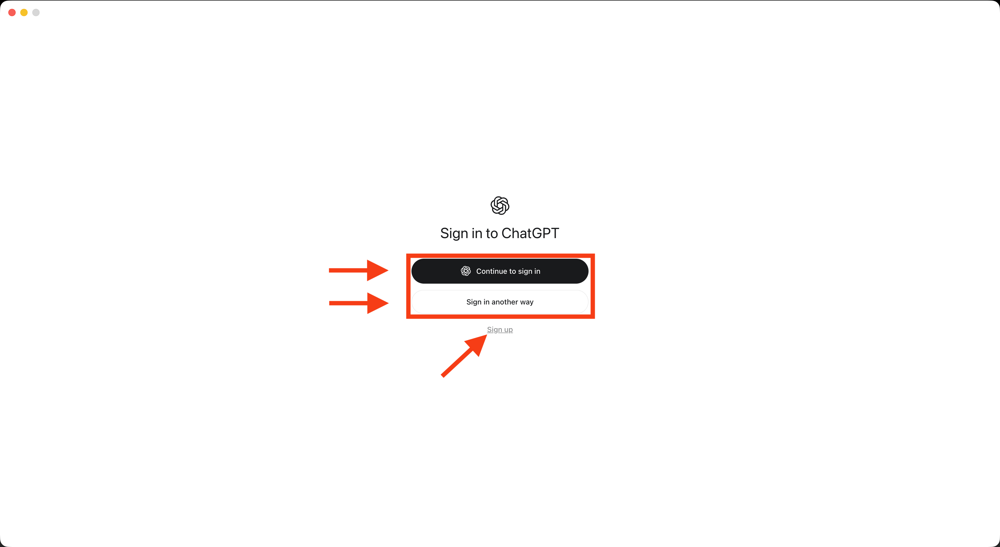

## Slide 19: Click Sign In

_First opening_

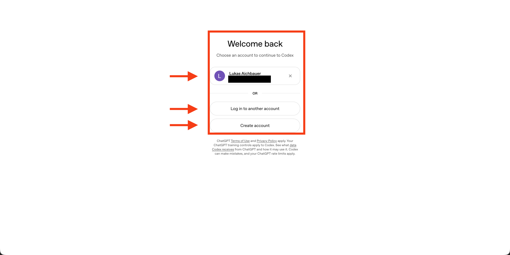

## Slide 20: Continue Sign-In

_First opening_

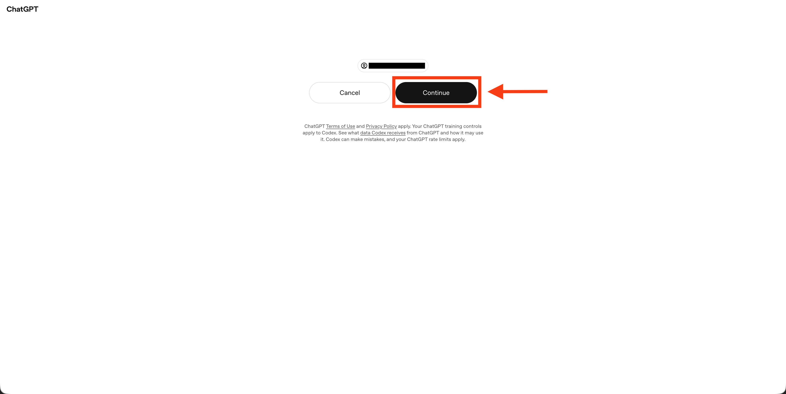

## Slide 21: Sign-In Successful

_First opening_

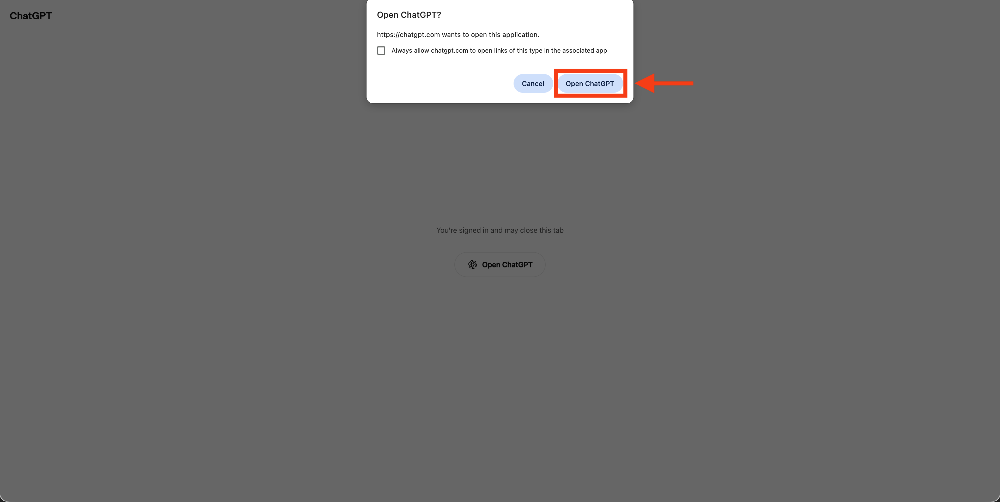

## Slide 22: Codex Home

_After first login_

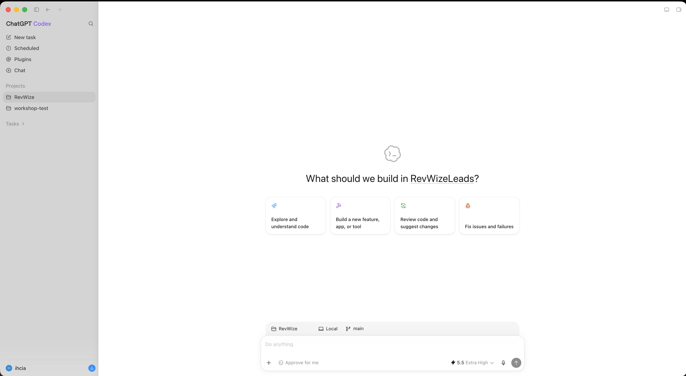

## Slide 23: Create New Project

_Project setup_

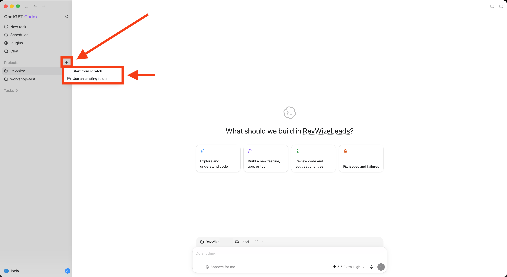

## Slide 24: Name the Project

_Project setup_

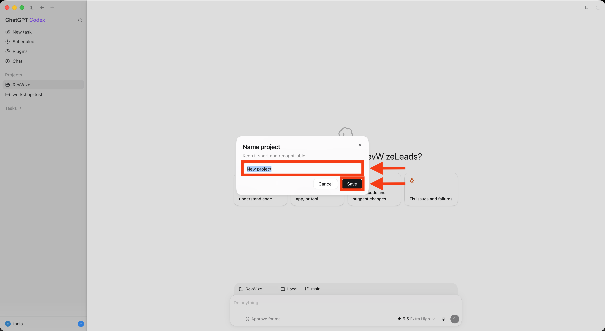

## Slide 25: Select a Project

_Where to choose the project_

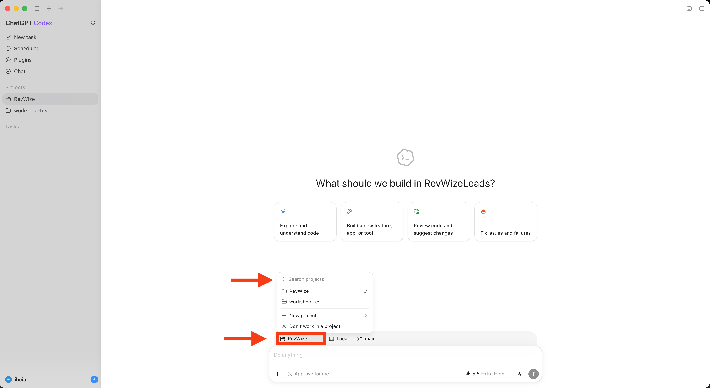

## Slide 26: Quick Practice Run – Coding

_Before we start with your own use cases_

**Mini Todo List App**

A simple task list with add, complete, delete, and empty states.

Good for making forms, lists, state, and small data models tangible.

**Clone a Landing Page**

Rebuild a landing page from a screenshot.

Good for practicing layout, typography, colors, spacing, and responsive details.

[Ideas](https://excalidraw.com/#room=fae440cad3935c8cd21e,5SXK_ml_xSQCC_sP_CaovQ)

## Slide 27: Quick Practice Run – Everyday Tasks

_Before we start with your own use cases_

**Research in the Browser**

Visit three event venues in the browser and compare capacity, location, and contact details.

Practice navigating websites and collecting results with source links.

**Send an Email**

Turn three bullet points into an email, enter your own address, check the draft, and send it.

Practice using a mail app and checking the recipient, subject, and message.

## Slide 28: OpenAI Models at a Glance

_GPT-6 & GPT-5.6 · Everyday work & creative tasks · Checked 16 Sep 2026_

| Model | Focus / typical uses | Reasoning effort |
| --- | --- | --- |
| GPT-6 Astra | Most demanding work | low → max |
| GPT-5.6 Sol | Complex professional work | none → max |
| GPT-5.6 Terra | Balance quality and cost | none → max |
| GPT-5.6 Luna | Low cost at high volume | none → max |

Reasoning = how much effort the model puts into working through your task. A quick rewrite needs little; comparing options against several requirements may benefit from more. More effort can mean a longer wait. none = off; low → max = little to maximum.

Speaker notes: Selected API models; availability in the Codex model picker may differ. Context figures are API limits. Arrows abbreviate supported effort levels. GPT-6 Astra: low, medium, high, xhigh, max. GPT-5.6 Sol/Terra/Luna: none, low, medium, high, xhigh, max. Source: https://developers.openai.com/api/docs/models
Typical uses are illustrative applications of the official model positioning: Astra for the hardest end-to-end work, Sol for complex professional work, Terra for balancing intelligence and cost, and Luna for cost-sensitive high-volume workloads. They are not exclusive capabilities or benchmark-based task rankings.

## Slide 29: OpenAI Models: Context and Knowledge

_GPT-6 & GPT-5.6 · Everyday work & creative tasks · Checked 16 Sep 2026_

| Model | Context (tokens) | Max output (tokens) | Knowledge cutoff |
| --- | --- | --- | --- |
| GPT-6 Astra | 1.05M | 128,000 | 30 Apr 2026 |
| GPT-5.6 Sol | 1.05M | 128,000 | 16 Feb 2026 |
| GPT-5.6 Terra | 1.05M | 128,000 | 16 Feb 2026 |
| GPT-5.6 Luna | 1.05M | 128,000 | 16 Feb 2026 |

Context = what fits on the model’s desk at once: conversation, briefing and documents. Tokens are small text pieces; M = million. Knowledge cutoff = the model’s built-in knowledge date; newer facts need current sources.

Speaker notes: Selected API models; availability in the Codex model picker may differ. Context figures are API limits. Arrows abbreviate supported effort levels. GPT-6 Astra: low, medium, high, xhigh, max. GPT-5.6 Sol/Terra/Luna: none, low, medium, high, xhigh, max. Source: https://developers.openai.com/api/docs/models
Typical uses are illustrative applications of the official model positioning: Astra for the hardest end-to-end work, Sol for complex professional work, Terra for balancing intelligence and cost, and Luna for cost-sensitive high-volume workloads. They are not exclusive capabilities or benchmark-based task rankings.

## Slide 30: OpenAI Models: API Pricing

_GPT-6 & GPT-5.6 · Everyday work & creative tasks · Checked 16 Sep 2026_

| Model | Input (USD / 1M) | Output (USD / 1M) |
| --- | --- | --- |
| GPT-6 Astra | $10.00 | $50.00 |
| GPT-5.6 Sol | $4.00 | $20.00 |
| GPT-5.6 Terra | $2.00 | $12.00 |
| GPT-5.6 Luna | $0.20 | $1.20 |

Prices in USD per 1M tokens: standard API rates for short context and uncached input. Input = material sent; output = generated tokens. Long context costs more.

[Sources: OpenAI model catalog](https://developers.openai.com/api/docs/models)

[OpenAI API pricing (USD / 1M tokens)](https://developers.openai.com/api/docs/pricing)

Speaker notes: Selected API models; availability in the Codex model picker may differ. Context figures are API limits. Arrows abbreviate supported effort levels. GPT-6 Astra: low, medium, high, xhigh, max. GPT-5.6 Sol/Terra/Luna: none, low, medium, high, xhigh, max. Source: https://developers.openai.com/api/docs/models
Typical uses are illustrative applications of the official model positioning: Astra for the hardest end-to-end work, Sol for complex professional work, Terra for balancing intelligence and cost, and Luna for cost-sensitive high-volume workloads. They are not exclusive capabilities or benchmark-based task rankings.

## Slide 31: How Does Reasoning Work?

_An internal working draft before the answer_

The model generates internal reasoning tokens: intermediate steps that are normally hidden from you.

**This lets it**

- Break the task into smaller steps.
- Compare approaches and check intermediate results.
- Revise an approach and develop the answer.

More reasoning = more computation for these steps. It can help with difficult tasks and take longer; correctness is not guaranteed.

[Source: OpenAI — Reasoning](https://developers.openai.com/api/docs/guides/reasoning)

Speaker notes: Simplified explanation of the documented mechanism. Internal reasoning tokens are not directly exposed; displayed summaries are not the complete internal process. Reasoning may also occur between tool calls. Source: https://developers.openai.com/api/docs/guides/reasoning

## Slide 32: Reasoning and Agents

_An internal working draft before the answer_

**Reasoning & agents**

Reasoning is a model’s ability to work through a task. An agent uses a model and tools to act, check results and continue working.

Example: reasoning helps weigh a campaign budget. An agent can also open the budget file and save the plan as a document.

Speaker notes: Simplified explanation of the documented mechanism. Internal reasoning tokens are not directly exposed; displayed summaries are not the complete internal process. Reasoning may also occur between tool calls. Source: https://developers.openai.com/api/docs/guides/reasoning

## Slide 33: Select a Model

_Where to choose the model_

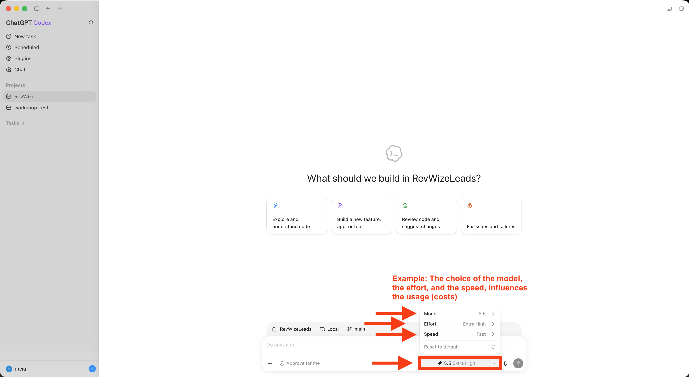

## Slide 34: Select Workspace

_Where the agent works_

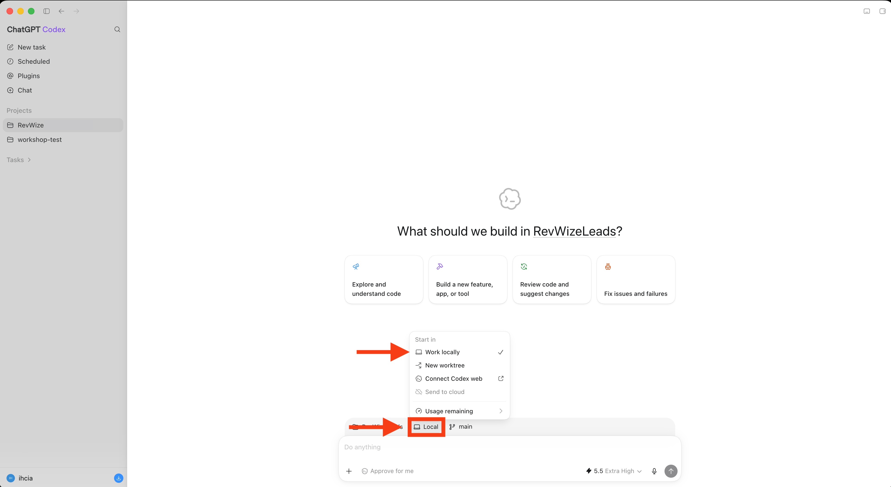

## Slide 35: Include Plugins

_Available tools_

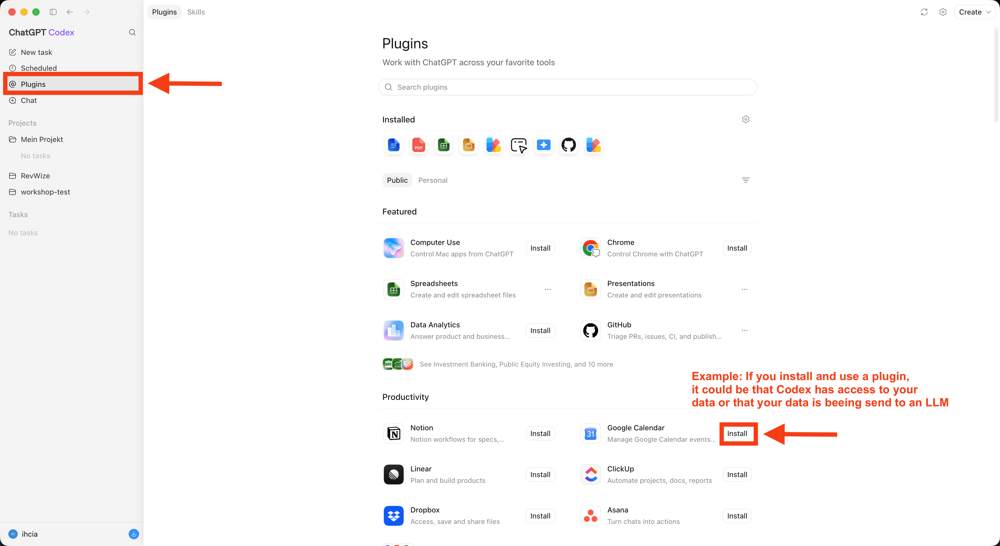

## Slide 36: What Is an Automation?

_Tasks on a schedule_

An automation starts a predefined task automatically when its trigger occurs.

Example: a weekly report

**Schedule**

09:00
Every Monday

**Task**

Summarize project updates
The agent follows your instructions

**Result**

Weekly report
Ready for you to review

Repeat next Monday at 09:00

Set it up once. Run it at every scheduled time.

Speaker notes: The time is an example, not an actual running automation. Explain the trigger, the saved instructions, and the result. The return arrow means a new run at the next scheduled time, not a task that runs continuously. Other automations can start from an event instead of a schedule.

## Slide 37: Create Automations

_Automation setup_

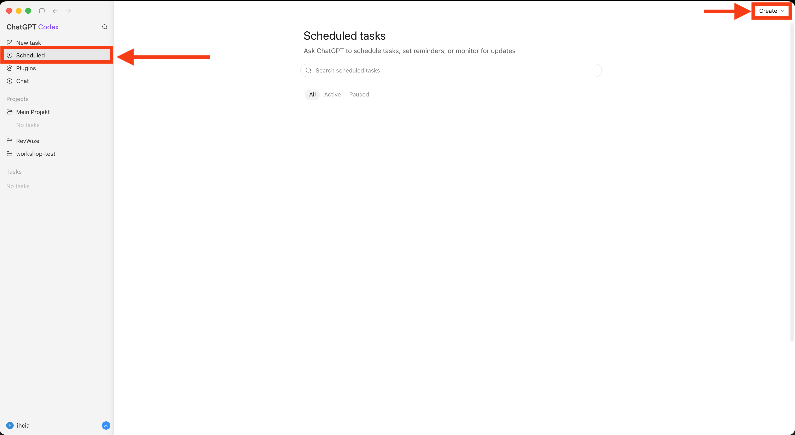

## Slide 38: Configure Automations

_Automation setup_

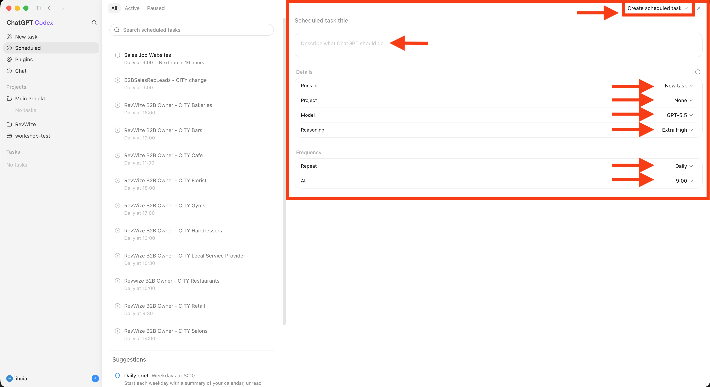

## Slide 39: Daily Research

_Automated every day at 09:00 AM_

**Competitor Research**

Check selected competitors’ websites for new products, pricing changes, and campaigns.

Result: a brief summary of changes since the last run, with source links.

**Customer Research**

Check selected customers’ websites and public news for announcements, projects, and changes in their business.

Result: a brief summary per customer, with source links and possible topics for your next conversation.

## Slide 40: Find Usage

_Account usage_

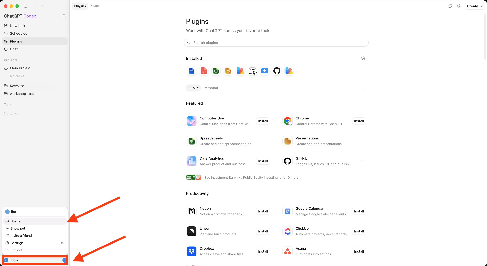

## Slide 41: Usage Details

_Account usage_

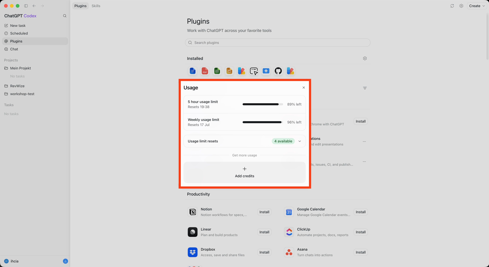

## Slide 42: Which Use Cases Are Good Starting Points?

_Start small, create real value_

| A good first use case is | How to recognize it |
| --- | --- |
| frequent | the task comes up regularly |
| time-consuming | it noticeably absorbs attention |
| easy to check | a good result is recognizable |
| low-risk | mistakes are easy to spot and correct |
| context-rich | examples, files, and rules are available |

## Slide 43: Use Case Board

_Excalidraw_

[Find your usecase](https://excalidraw.com/#room=3f7fb564ea3a699c6fd3,sDK2_w9L9RRcSUgP1PYFTA)

## Slide 44: Exercise 1: Define Input and Output

_Duration: 5 minutes_

**Questions**

- What does the program receive?
- In which format?
- What should it create?
- What should the result look like?

| Input | Output |
| --- | --- |
| file | summary or report |
| notes | task list |
| URL | screenshots and issues |
| CSV table | themes and examples |

**Examples:** Input can be a file, a note, a URL, a CSV file, or other material.

## Slide 45: Exercise 2: Break Down the Process

_Duration: 5 minutes_

Goal: describe the task in small, clear steps that an agent can follow.

**General Example**

1. Choose input: which file, note, or website should be processed?
2. Open input: load the file or visit the website and read its content.
3. Collect information: find the details that matter for the task.
4. Apply rules: check, sort, or edit the information according to your instructions.
5. Gather results: put the findings together and flag missing or unclear information.
6. Create output: produce a list, CSV file, Excel spreadsheet, or PowerPoint presentation, send the result by email, or turn it into a website.

## Slide 46: Exercise 3: Collect Rules and Examples

_Duration: 5 minutes_

Write 3–5 specific rules: what must the result contain, what should it look like, and what must not happen?

**Which rules do you need?**

- Content: which details must be included?
- Format: list, table, or prose? How long?
- Language: which tone and terminology?
- Missing information: ask, flag, or skip?
- Check: what does a good and a bad result look like?

**General Rules**

- Include all required details. Do not invent information.
- Follow the agreed format, order, and maximum length.
- Write clearly and use the agreed language and tone.
- Flag missing or unclear information and ask questions when needed.
- Check the result for completeness, contradictions, and remaining placeholders.

## Slide 47: Summary: Basics

_Important words and metaphors_

| Word | Meaning | Metaphor |
| --- | --- | --- |
| LLM | A language model that predicts likely next text pieces from input. | 🧠 Brain |
| Token | A small text piece: a word part, word, or character string. | 🧩 Text building block |
| Chatbot | An interface that sends messages to an LLM and shows answers. | 👀👂👄 Eyes, ears, mouth |
| Agent | An LLM-based system that can use tools, act, check, and continue. | 🤲💪🦵 Hands, arms, feet |
| Prompting | Asking in chat and deciding yourself what to do with the answer. | 📖 Ask for a recipe |
| Vibe Coding | Loosely describing software, trying it, and adjusting by feel. | 🍝 "Something pasta-ish" |
| Agentic Coding | Giving goal, context, files, rules, and boundaries so an agent can implement. | 🍲 Chef in the kitchen |

## Slide 48: Summary: Codex

_Setup words and metaphors_

| Word | Meaning | Metaphor |
| --- | --- | --- |
| Codex | An agentic coding environment that can work with your project files. | 🧑‍🍳 Chef cook |
| Project | The place where your work is organized inside Codex. | 🏪 Restaurant |
| Model | The selected AI brain Codex uses for the task. | 🧠 Chef's brain |
| Workspace | The project folder where the agent is allowed to read and change files. | 🍳 Kitchen |
| Tool | Programs and apps the agent can use. | 🛠️ Kitchen tools |
| Plugin | A special program made for Codex. | 🧰 Special kitchen tool |
| Automation | A repeatable agent task that can run on a configured trigger. | ⏲️ Kitchen timer |
| Usage | The account area where you can see how much Codex has been used. | 💸 Salary for the cook |

## Slide 49: Summary: Use Cases

_Instructions and metaphors_

| Word | Meaning | Metaphor |
| --- | --- | --- |
| Use Case | A concrete task where AI can create value in a workflow. | 📋 Dish on the menu |
| Input | The material the program receives: file, notes, URL, or table. | 🥕 Ingredients |
| Output | The result the program should create: report, list, screenshots, or app. | 🍽️ Finished dish |
| Rule | A fixed condition the result must follow. | 📏 Cooking rule |
| Check Criteria | How you know the task is done well enough. | 👅 Taste test |
| Error Case | A situation where the input or result is missing, wrong, or unclear. | ❓ Missing ingredient |
| Human Approval | A decision that stays with a person, such as publishing or deleting data. | ✅ Chef signs off |

## Slide 50: Summary: Choosing a Good Use Case

_Instructions and metaphors_

| Good use case is | How to recognize it | Metaphor |
| --- | --- | --- |
| Frequent | The task comes up regularly. | 🔁 Regular order |
| Time-consuming | It noticeably absorbs attention. | ⏳ Long prep time |
| Easy to check | A good result is recognizable. | 🔍 Quality check |
| Low-risk | Mistakes are easy to spot and correct. | 🛟 Safety net |
| Context-rich | Examples, files, and rules are available. | 🗂️ Recipe archive |
